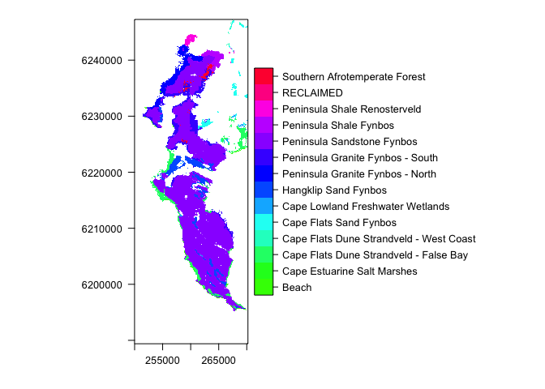
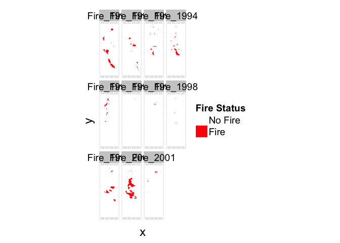
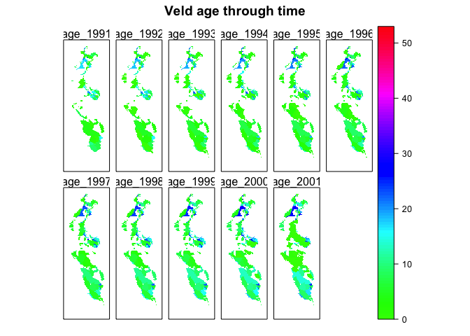

# DataPrep
Jasper Slingsby & Adam M. Wilson  
July 22, 2014  


This script assembles various environmental layers into a common 30m grid for the Cape Peninsula.  It also calculates veg age based on the fire data.

## Index raster
Create a raster of an index grid (`ig`) to spatially connect all the datasets.

```r
ig=raster(paste0(datadir,"clean/indexgrid_landsat_30m.grd")) 
```

## Vegetation 


```r
rv=readOGR(dsn=paste0(datadir,"raw/VegLayers/Vegetation_Indigenous_Remnants"), layer="Vegetation_Indigenous_Remnants") #remnant veg layer - readOGR() reads shapefiles
```

```
## OGR data source with driver: ESRI Shapefile 
## Source: "/Users/adamw/Dropbox/Postfire_workshop/Data/raw/VegLayers/Vegetation_Indigenous_Remnants", layer: "Vegetation_Indigenous_Remnants"
## with 3428 features and 7 fields
## Feature type: wkbPolygon with 2 dimensions
```

```r
#rv; summary(rv$National_); summary(rv$Subtype); summary(rv$Community); levels(rv@data$National_)
rv_meta=data.frame(1:length(levels(rv@data$National_)), levels(rv@data$National_)) #save VegType metadata
colnames(rv_meta)=c("ID", "VegType") #rename columns
write.csv(rv_meta, paste0(datadir,"clean/vegtypecodes.csv", row.names=F))

# reproject to the CRS of the Landsat index grid (UTM 34S)
rv=spTransform(rv,CRS(proj4string(ig)))
```

Extract the national veg types from the veg layer into a 30m raster based on the index grid

```r
rvrfile="data/vegtypes_landsat_30m.tif"
if(!file.exists(rvrfile))
  rvr=rasterize(rv, ig, field=c("National_"), fun="max",file=rvrfile) #get national veg type for each cell
rvr=raster(rvrfile)
plot(rvr)
```

 

Count number of veg types for each cell (i.e. ID mixed cells)

```r
rvcfile="data/count_vegtypes_landsat_30m.tif"
if(!file.exists(rvcfile))
  rvc=rasterize(rv, ig, field=c("National_"), fun="count",file=rvcfile) 
rvc=raster(rvcfile)
table(values(rvc))
```

```
## 
##      1 
## 342151
```

## Fire data

```r
fi=readOGR(dsn=paste0(datadir,"raw/Fire"), layer="CapePenFires") #Cape Peninsula fires history layers 1962-2007
```

```
## OGR data source with driver: ESRI Shapefile 
## Source: "/Users/adamw/Dropbox/Postfire_workshop/Data/raw/Fire", layer: "CapePenFires"
## with 4578 features and 9 fields
## Feature type: wkbPolygon with 3 dimensions
```

```
## Warning: Z-dimension discarded
```

```r
fi=spTransform(fi,CRS(proj4string(ig)))

### Extract fire history data and convert to a 30m raster
fi$STARTDATE[which(fi$STARTDATE==196201001)]=19620101#fix an anomalous date...

#Raster showing total numbers of fires in each grid cell
## note the if(!file.exists)) first checks if the file already exists so you don't rerun this everytime you run the script.
ficfile="data/fires_number_1962to2007_landsat_30m.tif"
if(!file.exists(ficfile))
    fic=rasterize(fi, ig, field=c("STARTDATE"), fun="count",file=ficfile) 

fic=raster(ficfile)
```


### Rasterize fire data into annual fire maps 

```r
years=sort(unique(fi$YEAR)) #get the unique list of years in which fires occurred
years=1962:2014
#years=years[years>1981] #trim to 1982 onwards (our earliest reliable Landsat data)

## first check if file already exists, if not, run this
rfifile="data/fires_annual_landsat_30m.tif"
if(!file.exists(rfifile)) {
rfi=foreach(y=years,.combine=stack,.packages="raster") %dopar% {
 #loop through years making a raster of burnt cells (1/0) for each
  ## check if there were any fires that year, if not, return zeros
  if(sum(fi$YEAR==y)==0) 
      td= raster(extent(ig),res=res(ig),vals=0)
  ## if there is >0 fires, then rasterize it to the grid
  if(sum(fi$YEAR==y)>0) 
      td=rasterize(fi[which(fi$YEAR==y),],ig, field="YEAR", fun="count", background=0) 
  ## return the individual raster
  return(td)
  }
writeRaster(rfi,file=rfifile)#,options=c("COMPRESS=LZW","PREDICTOR=2"))
}

rfi=stack(rfifile)
## add year as name
names(rfi)=paste0("Fire_",years)
```


```r
levelplot(rfi[[30:40]],scales=list(draw=F),at=c(0,0.5,1),col.regions=c("transparent","red"),auto.key=F)
```

 


### Calculate veg age from fire history
Now we have an object `rfi` (rasterized fires) with one band/layer for each year with 0s and 1s indicating whether that pixel burned in that year.  We can use that to calculate the time since fire by setting the year that burned to 0 and adding 1 for each subsequent year until the next fire.  

First let's look at one pixel's data:


```r
x=as.vector(rfi[551072])
x2=rbind(fire=x)
colnames(x2)=years
kable(x2)
```


|     | 1962| 1963| 1964| 1965| 1966| 1967| 1968| 1969| 1970| 1971| 1972| 1973| 1974| 1975| 1976| 1977| 1978| 1979| 1980| 1981| 1982| 1983| 1984| 1985| 1986| 1987| 1988| 1989| 1990| 1991| 1992| 1993| 1994| 1995| 1996| 1997| 1998| 1999| 2000| 2001| 2002| 2003| 2004| 2005| 2006| 2007| 2008| 2009| 2010| 2011| 2012| 2013| 2014|
|:----|----:|----:|----:|----:|----:|----:|----:|----:|----:|----:|----:|----:|----:|----:|----:|----:|----:|----:|----:|----:|----:|----:|----:|----:|----:|----:|----:|----:|----:|----:|----:|----:|----:|----:|----:|----:|----:|----:|----:|----:|----:|----:|----:|----:|----:|----:|----:|----:|----:|----:|----:|----:|----:|
|fire |    0|    0|    0|    0|    0|    0|    0|    0|    0|    0|    1|    0|    0|    1|    0|    0|    0|    0|    0|    0|    0|    0|    0|    0|    0|    0|    0|    0|    0|    0|    1|    0|    0|    0|    0|    0|    0|    1|    0|    0|    0|    0|    0|    0|    0|    0|    0|    0|    0|    0|    0|    0|    0|


So we need a function that finds the fires and counts up each year.  We'll put in years before the first fire as negatives so we can identify them later.


```r
fage=function(x){
  ## if there are no fires, return all negative numbers
  if(sum(x)==0){return(-1:(-length(x)))}
  if(sum(x)>0){
    ## create empty vector of veg ages
    tage=rep(NA,length(years))
    ## years with fire
    fids=which(x>0)  
    tage[fids]=0
    ## fill in years before first fire
    tage[1:fids[1]]=-1:(-fids[1])
    ## Now loop through years and count up unless there was a fire
    for(i in (fids[1]+1):length(years))
    tage[i]=ifelse((i-1)%in%fids,0,tage[i-1]+1)
return(tage)
}}
```
Now let's try that: 

```r
x=as.vector(rfi[551072])
x2=rbind(fire=x,age=fage(x))
colnames(x2)=years
kable(x2)
```


|     | 1962| 1963| 1964| 1965| 1966| 1967| 1968| 1969| 1970| 1971| 1972| 1973| 1974| 1975| 1976| 1977| 1978| 1979| 1980| 1981| 1982| 1983| 1984| 1985| 1986| 1987| 1988| 1989| 1990| 1991| 1992| 1993| 1994| 1995| 1996| 1997| 1998| 1999| 2000| 2001| 2002| 2003| 2004| 2005| 2006| 2007| 2008| 2009| 2010| 2011| 2012| 2013| 2014|
|:----|----:|----:|----:|----:|----:|----:|----:|----:|----:|----:|----:|----:|----:|----:|----:|----:|----:|----:|----:|----:|----:|----:|----:|----:|----:|----:|----:|----:|----:|----:|----:|----:|----:|----:|----:|----:|----:|----:|----:|----:|----:|----:|----:|----:|----:|----:|----:|----:|----:|----:|----:|----:|----:|
|fire |    0|    0|    0|    0|    0|    0|    0|    0|    0|    0|    1|    0|    0|    1|    0|    0|    0|    0|    0|    0|    0|    0|    0|    0|    0|    0|    0|    0|    0|    0|    1|    0|    0|    0|    0|    0|    0|    1|    0|    0|    0|    0|    0|    0|    0|    0|    0|    0|    0|    0|    0|    0|    0|
|age  |   -1|   -2|   -3|   -4|   -5|   -6|   -7|   -8|   -9|  -10|  -11|    0|    1|    2|    0|    1|    2|    3|    4|    5|    6|    7|    8|    9|   10|   11|   12|   13|   14|   15|   16|    0|    1|    2|    3|    4|    5|    6|    0|    1|    2|    3|    4|    5|    6|    7|    8|    9|   10|   11|   12|   13|   14|

Now use `calc` to apply that to the full stack.

```r
agefile="data/ages_annual_landsat_30m.tif"
if(!file.exists(agefile))
    age=calc(rfi,fage,file=agefile,progress='text',dataType="INT1S")
age=stack(agefile)
names(age)=paste0("age_",years)
```


```r
levelplot(age[[30:40]],at=seq(0,53,len=100),col.regions=rainbow(100,start=.3),scales=list(draw=F),auto.key=F,
          main="Veld age through time")
```

 


## NDVI Compositing


```r
getNDVI=function(file,years,prefix){
  ndvi=stack(paste0(datadir,"raw/NDVI/",file))
  NAvalue(ndvi)=0
offs(ndvi)=-2
gain(ndvi)=.001
names(ndvi)=paste0(prefix,years)
ndvi=setZ(ndvi,years)
}
```

Now use the function to read in the data and add the relevant metadata.

```r
l4=getNDVI(file="20140722_26dbab02_LT4_L1T_ANNUAL_GREENEST_TOA__1982-1993-0000000000-0000000000.tif",
           years=1982:1993,prefix="L4_")
l5=getNDVI(file="20140722_26dbab02_LT5_L1T_ANNUAL_GREENEST_TOA__1984-2012-0000000000-0000000000.tif",
           years=1984:2012,prefix="L5_")
l7=getNDVI(file="20140722_26dbab02_LE7_L1T_ANNUAL_GREENEST_TOA__1999-2014-0000000000-0000000000.tif",
           years=1999:2014,prefix="L7_")
l8=getNDVI(file="20140722_26dbab02_LC8_L1T_ANNUAL_GREENEST_TOA__2013-2014-0000000000-0000000000.tif",
           years=2013:2014,prefix="L8_")
```

So there is some overlap between sensors, let's look at that:

```r
tl=melt(list(l4=getZ(l4),l5=getZ(l5),l7=getZ(l7),l8=getZ(l8)))
xyplot(as.factor(L1)~value,data=tl,type="l",groups=as.factor(L1),asp=.15,lwd=5,ylab="LANDSAT Satellite",xlab="Year")
```

 

There are several ways these data could be combined.  The individual scenes could be assessed for quality (cloud contamination, etc.), sensors could be weighted by sensor quality (newer=better?).  Today, we'll simply take the mean of available data for each year.  What are the limitations of this approach? 


```r
nyears=1984:2014

ndvifile="data/ndvi_annual_landsat_30m.tif"
if(!file.exists(ndvifile)){

  ndvi=foreach(y=nyears,.combine=stack,.packages="raster") %dopar% {
    # find which LANDSATs have data for the desired year
    w1=lapply(
      list(l4=getZ(l4),l5=getZ(l5),l7=getZ(l7),l8=getZ(l8)),
      function(x) ifelse(y%in%x,which(y==x),NA))
    # drop LANDSATs with no data for this year
    w2=w1[!is.na(w1)]
    # make a stack with the desired year for all sensors that have data
    tndvi=mean(stack(lapply(1:length(w2),function(i) {
        print(i)
      td=get(names(w2[i]))
      return(td[[w2[i]]])
    })),na.rm=T)
    return(tndvi)
    }
  writeRaster(ndvi,file=ndvifile,overwrite=T)
}

ndvi=stack(ndvifile)
names(ndvi)=paste0("n",nyears)
ndvi=setZ(ndvi,nyears)
```


```r
levelplot(ndvi,col.regions=cndvi()$col,cuts=length(cndvi()$at),at=cndvi()$at,margin=F,scales=list(draw=F))
```

 
