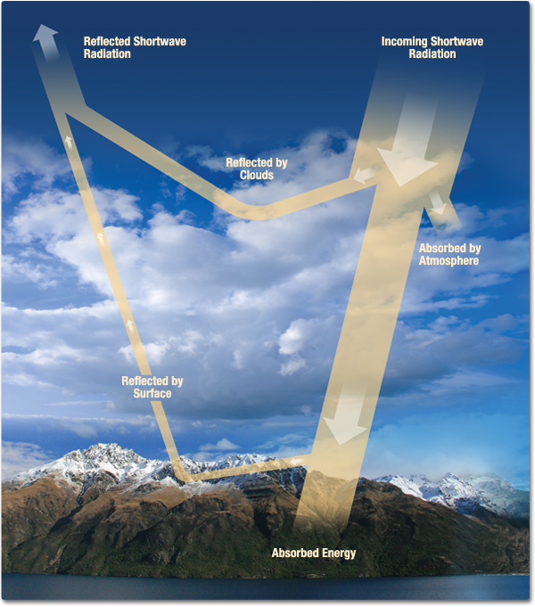

```{r,setup,echo=F,cache=F,results='hide',message=FALSE,error=FALSE,warning=FALSE}
##  First some set up
source("../setup.R")
## set the root directory when running from knitr
opts_knit$set(root.dir=getwd(),cache=T,base.url = NULL)
```




The GRASS function `r.sun` runs a solar irradiance and irradiation model using topographical data we generated above. From [the manual](http://grass.osgeo.org/grass65/manuals/r.sun.html): 

>> `r.sun` computes direct (beam), diffuse and reflected solar irradiation raster maps for given day, latitude, surface and atmospheric conditions. Solar parameters (e.g. sunrise, sunset times, declination, extraterrestrial irradiance, daylight length) are saved in the map history file. Alternatively, a local time can be specified to compute solar incidence angle and/or irradiance raster maps. The shadowing effect of the topography is optionally incorporated.

Or see a more [technical explanation of all the inputs and outputs here](http://re.jrc.ec.europa.eu/pvgis/solres/solmod3.htm). There are several parameters (e.g. albedo & atmospheric turbidity) for which we will use the default values.  


# Initialize GRASS from within R

GRASS can be run alone with a GUI, as a suite of command-line programs, or from within R.  This makes it possible to have a full-featured GIS from within your R workflows.  It is quite fast and generally requires very little memory.   However, there is a bit of a learning curve as there are some fundamental differences with other standard GIS programs (e.g. ESRI ArcGIS).  

To start GRASS from within R, it's easiest to have a `SpatialGridDataFrame` to define the region and resolution of the data.  Let's read in the elevation data to initialize a new GRASS session/location.

```{r}
dem=as(raster(paste0(datadir,"/Clean/dem_landsat_30m.gri")),"SpatialGridDataFrame")
```

Now initialize a grass session. By default this will create this in the `tempdir()` used by R, you can change that by setting `home` and `gisDbase` when you call `initGRASS`.

```{r,results='hide'}
initGRASS(gisbase,SG=dem,override=T,location="CapePoint",mapset="PERMANENT")
## update projection of the 'location' to use the grid of the dem
execGRASS("g.proj", flags="c",proj4=proj4string(dem))
# import the dem data into grass
writeRAST6(dem, "dem", zcol = 1, NODATA=NULL, ignore.stderr = NULL, useGDAL=NULL, overwrite=TRUE, flags=NULL)
## If the dem is in a format gdal can read directly, you can do this instead...
#execGRASS("r.in.gdal", flags="overwrite",input=,output="dem")
```


## A note about 'regions' in GRASS
One really nice feature of GRASS is that it allows you to specify your working 'region' and all calculations will be done only for that region.  So for testing, you can set a small region (which runs quickly) then simply change one line to scale up to a larger region.  Let's limit it to the Silvermine Reserve as an example.

There is a shapefile in the 'raw' data directory that has all the reserves on the peninsula, but it's in WGS84 (lat-lon).  Before importing to GRASS, we need to project it to match the other data.  This is an example of how GRASS can be annoying, but forces good behavior (like keeping track of which projection your data is in).  There are a few ways to do this, but we'll use the `spTransform()` function in the sp package.
```{r,results='hide',warning=FALSE,error=FALSE}
reserves=readOGR(paste0(datadir,"raw/reserves/"),"reserves")
reserves=spTransform(reserves,CRS(proj4string(dem)))
## push it to the GRASS database (remember GRASS can't direcly access things in R's memory)
writeVECT6(reserves,"reserves",v.in.ogr_flags = "overwrite")
```

Let's check out the attribute table:
```{r,results='asis',echo=FALSE}
kable(head(reserves@data))
```

Now use `v.extract`, `g.region`, and `v.to.rast` to subset to the Silvermine reserve and mask regions outside the reserve.

```{r,results='hide',fig.width=8}
resname="SILVERMINE"
execGRASS("v.extract",flags="overwrite", input="reserves",output="reservesubset",where=paste0("MASTERNAME = '",resname,"'"))
execGRASS("g.region",flags="overwrite", rast="dem",vect="reservesubset")
execGRASS("v.to.rast",flags="overwrite",input="reservesubset",use='val',value=1,output="MASK")
```

# Calculate slope and aspect

`r.sun` needs slope and aspect as inputs, calculate them with `r.slope.aspect`.  This will create two new raster layers named `slope` and `aspect`.
```{r,results='hide'}
execGRASS("r.slope.aspect",flags="overwrite",elevation="dem",slope="slope",aspect="aspect")
```

Note how fast that was?  It's only running on a small region...  Let's take a look:

```{r,results='hide'}
slope=raster(readRAST6("slope"))
aspect=raster(readRAST6("aspect"))
topo=stack(slope,aspect)
plot(topo,xaxt="n",yaxt="n")
```

Looks a little strange, but that's the shape of the reserve.  Now let's zoom back and do it for the full peninsula by setting the 'region' to be equal to the elevation dataset.  In practice you wouldn't repeat this code in a script but rather just change the region above.  

```{r,results='hide'}
## set the region to match the elevation dataset
## if you want to only process a subset of the dem, specify it here
execGRASS("g.region", rast="dem")
execGRASS("g.remove",rast="MASK")
```

And run the calculations again for the full peninsula.  
```{r,fig.width=8,results='hide'}
execGRASS("r.slope.aspect",flags="overwrite",elevation="dem",slope="slope",aspect="aspect")
slope=raster(readRAST6("slope"))
aspect=raster(readRAST6("aspect"))
topo=stack(slope,aspect)
plot(topo,xaxt="n",yaxt="n")
```

If your computer choked on those, you should probably define the region to be something smaller for the following section.  Either set it back to the Silvermine reserve or choose another region.  See [g.region](http://grass.osgeo.org/grass65/manuals/g.region.html) help for details on how to set this in different ways (such as an X-Y box).

-------------------------
# Solar Radiation 

## Data Inputs

These are absolutely necessary:

* elevation
* latitude & longitude (these will be automatically extracted from the elevation data)
* aspect
* slope

The following parameters/maps are also important, but difficult to aquire.  For this exercise we'll use default values.

* Linke atmospheric turbidity coefficient
* ground albedo
* real-sky beam radiation coefficient (thick cloud)
* real-sky diffuse radiation coefficient (haze)
* horizon information

Please check the [technical explanation](http://re.jrc.ec.europa.eu/pvgis/solres/solmod3.htm) if you want more information on units or how `r.sun` does the calculation.

## Processing inputs

 * Angle step size for multidirectional horizon
 * Day of the year (1-365)
 * Time step when computing all-day radiation sums [decimal hours]

## Outputs
Total irradiance/irradiation raster map [Wh m<sup>-2</sup> day<sup>-1</sup>]

Now we have all the data necessary to calculate incoming potential solar radiation (relying on default values for several parameters).  

## Create a table of dates to process
As `r.sun` estimates either an instantaneous incoming radiation (for a particular time in a particular day) or a daily average (by calculating numerous instantaneous estimates), we'll need to loop through various days to get monthly/seasonal/annual statistics.  So let's create a table with one row for every day that we want `r.sun` to estimate.  The year doesn't matter, only the day and month...
```{r,results='hide'}
startdate=as.Date("2001-01-01")
stopdate=as.Date("2001-12-31")

## specify the frequency of the radiation calculation. 
## "day" is best (daily estimates averaged by month), "week" is good, but "month" is much faster
by="month"

## build table of dates to process
dates=data.frame(date=(seq(startdate,stopdate,by=by)))
dates$doy=format(dates$date,"%j")
dates$month=as.numeric(format(dates$date,"%m"))
dates$season=ifelse(dates$month%in%c(12,1,2),"Summer",
                    ifelse(dates$month%in%c(3,4,5),"Fall",
                           ifelse(dates$month%in%c(6,7,8),"Winter","Spring")))
```

The daily total solar radiation will be calculated for each row (n=`r nrow(dates)`) in this table:
```{r,results='asis',echo=FALSE}
kable(head(dates))
```


## Loop through days and run the calculation
Now we have the set of necessary data (_dem_, _aspect_, and _slope_).  Let's Loop through the dates specified above and calculate radiation.  This will save a raster object as `rad_tot.001` for January 1<sup>st</sup>, etc.    
```{r,results='hide'}
foreach(i=1:nrow(dates)) %dopar% {
  day=dates$doy[i]
  print(paste0("Processing day ",day))
       execGRASS("r.sun",flags=c("s","overwrite"),
                 elevin="dem",aspin="aspect",slopein="slope",
                 day=as.numeric(day),lin=3.0,step=2,dist=1,
                 glob_rad=paste0("rad_tot.",day))
  return(day)
}
```


# Summarize and export monthly maps
Summarize the (daily?) radiation by month
```{r,results='hide'}
if(!file.exists("data/rad")) dir.create("data/rad",recursive=T)
foreach(m=unique(dates$month)) %dopar% {
  mo=sprintf("%02d",m) # add leading zeros, e.g. "1" to "01"
  execGRASS("r.series",flags="overwrite",input=paste0("rad_tot.",dates$doy[dates$month==m],collapse=","),
    output=paste0("rad_month_",mo),method="average")
  return(mo)
  }

```

## Export to geotifs
Write out the summarized tiffs to the data directory
```{r,results='hide'}
if(!file.exists("data/rad")) dir.create("data/rad",recursive=T)
foreach(m=unique(dates$month)) %dopar% {
  mo=sprintf("%02d",m) # add leading zeros, e.g. "1" to "01"
  ## write the data out to a tif
    execGRASS("r.out.gdal",input=paste0("rad_month_",mo),output=paste0("data/rad/rad_",mo,".tif"),
              createopt="COMPRESS=LZW",createopt="zlevel=9",nodata=-999)
}
```


## Visualize the results

Import them to R for plotting.
```{r}
rad=stack(list.files("data/rad",pattern="tif$",full=T))
levelplot(rad,xaxt="n",yaxt="n",col.regions=rev(rainbow(20,end = .7)),scales=list(draw=F),
          main=expression(paste("Monthly Total Solar Irradiance (",Wh * m^{-2} * day^{-1},")")))
```

# Excercises

* What is the total annual incoming radiation?  hint: use the `r.series` function and a modified input parameter.  
* How much diffent is solar radiation in the summer vs. winter?  You could do this in GRASS or import the rasters to R and use functions in the raster package.

## References

* [The GRASS Books](http://grass.osgeo.org/documentation/books/)
* [spgrass6 R package](http://cran.r-project.org/web/packages/spgrass6/index.html)

```{r,purl,echo=FALSE,results='hide',messages=F,error=FALSE,background=T}
## this chunk outputs a copy of this script converted to a 'normal' R file with comments
#purl("workflow/SolarRadiation/SolarRadiation.Rmd",documentation=2,output="workflow/SolarRadiation/SolarRadiation.R", quiet = TRUE)
```
