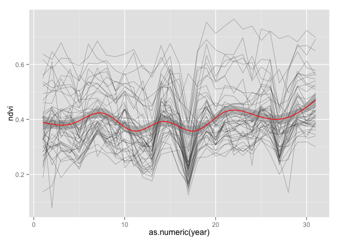
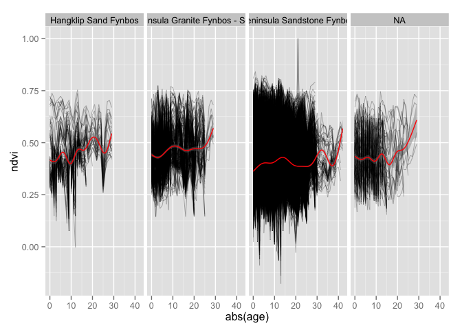

# PostFireTrajectories
Adam M. Wilson  
July 22, 2014  


# Data

Load the model data we made in [DataPrep.Rmd](../1_Data/DataPrep.Rmd)

```r
load("data/modeldata.Rdata")
rv_meta=read.csv("data/vegtypecodes.csv")
sdat$vegn=rv_meta$code[match(sdat$veg,rv_meta$ID)]

## now create a single monster table with all the data
dat=cbind.data.frame(tdatl,sdat[match(tdatl$id,sdat$id),])
kable(head(dat),row.names=F)
```


|    id|year | age|   ndvi|    id|      x|       y| veg| cover|  tmax|  tmin|   dem|   tpi|vegn                         |
|-----:|:----|---:|------:|-----:|------:|-------:|---:|-----:|-----:|-----:|-----:|-----:|:----------------------------|
| 83925|1984 | -23| 0.2790| 83925| 260445| 6243525|  18|     1| 28.19| 9.413| 152.5| 7.934|Peninsula Shale Renosterveld |
| 83925|1985 | -24| 0.5820| 83925| 260445| 6243525|  18|     1| 28.19| 9.413| 152.5| 7.934|Peninsula Shale Renosterveld |
| 83925|1986 | -25| 0.4830| 83925| 260445| 6243525|  18|     1| 28.19| 9.413| 152.5| 7.934|Peninsula Shale Renosterveld |
| 83925|1987 | -26| 0.3160| 83925| 260445| 6243525|  18|     1| 28.19| 9.413| 152.5| 7.934|Peninsula Shale Renosterveld |
| 83925|1988 | -27| 0.3080| 83925| 260445| 6243525|  18|     1| 28.19| 9.413| 152.5| 7.934|Peninsula Shale Renosterveld |
| 83925|1989 | -28| 0.4155| 83925| 260445| 6243525|  18|     1| 28.19| 9.413| 152.5| 7.934|Peninsula Shale Renosterveld |


## Change through time

It's still hard to see change while looking at the full peninsula, so let's:

1. pick a few pixels and plot NDVI as a function of time.  
2. zoom in on a smaller region

But first we need to pick a pixel (or a few) to plot.  There are a few ways to do this.  First let's try extracting values from a single cell:

```r
plot(c(ndvi[199165])~getZ(ndvi),type="l",ylab="NDVI",xlab="Year")
```

Or, we can use the `click` function (in Raster) that allows you to pick points on the map.  First we need to plot the data using the plot() command.


```r
## first plot the data
plot(l5[[1]])
## specify how many points you want to select
nclicks=5
d=click(l5,xy=T,n=nclicks,cell=T,id=TRUE,type="l")
## now click on the map to select your points

## reshape the data for easy plotting
d$id=1:nrow(d)
d2=melt(d,id.var=c("x","y","cell","id"));colnames(d2)=c("X","Y","Point","id","Year","NDVI")
d2$Year=as.numeric(sub("Y","",d2$Year))
p1=xyplot(NDVI~Year,groups=id,data=d2,type="l",auto.key=list(x=0,y=1))
p2=levelplot(L5[[1]],col.regions=cndvi()$col,cuts=length(cndvi()$at),at=cndvi()$at,margin=F)+
  layer(panel.text(d$x,d$y,d$id,col="red",cex=2))
print(c(p1,p2,merge.legends=T))
```


### Regional plot

Alternatively, we can aggregate the data from a larger region.  First import a shapefile of the reserves on the peninsula and the fire data.

```r
reserves=readOGR(paste0(datadir,"raw/reserves/"),"reserves")
```

```
## OGR data source with driver: ESRI Shapefile 
## Source: "/Users/adamw/Dropbox/Postfire_workshop/Data/raw/reserves/", layer: "reserves"
## with 50 features and 9 fields
## Feature type: wkbPolygon with 2 dimensions
```

```r
reserves=spTransform(reserves,CRS(proj4string(ig)))


fi=readOGR(dsn=paste0(datadir,"raw/Fire"), layer="CapePenFires") #Cape Peninsula fires history layers 1962-2007
```

```
## OGR data source with driver: ESRI Shapefile 
## Source: "/Users/adamw/Dropbox/Postfire_workshop/Data/raw/Fire", layer: "CapePenFires"
## with 4578 features and 9 fields
## Feature type: wkbPolygon with 3 dimensions
```

```
## Warning: Z-dimension discarded
```

```r
fi=spTransform(fi,CRS(proj4string(ig)))
```

Now select a region to explore.  You could do a single fire, a single reserve, or any combination of regions using the code below.  

```r
resname="SILVERMINE"

reg1=reserves[which(reserves$MASTERNAME==resname),]
#reg1=fi[which(fi$FIREID==2000103),]
## get cell numbers in that region
rd=extract(ig,reg1)[[1]]
levelplot(dem~x*y,data=sdat[sdat$id%in%rd,],main="Elevation")+latticeExtra::layer(sp.polygons(reg1))
```

 


```r
ggplot(dat[dat$id%in%sample(rd,50),],aes(x=as.numeric(year),y=ndvi,group=id))+
  geom_line(size=.2,alpha=.5)+
  stat_smooth(fill = "grey50",aes(group = 1),col="red")
```

```
## geom_smooth: method="auto" and size of largest group is >=1000, so using gam with formula: y ~ s(x, bs = "cs"). Use 'method = x' to change the smoothing method.
```

 

```r
ggplot(dat[dat$age>=0&dat$id%in%sample(rd,10000),],aes(x=abs(age),y=ndvi,group=id))+
  geom_line(size=.2,alpha=.5)+facet_grid(. ~ vegn)+
  stat_smooth(fill = "grey50",aes(group = 1),col="red")#+xlim(0, 30)
```

```
## geom_smooth: method="auto" and size of largest group is >=1000, so using gam with formula: y ~ s(x, bs = "cs"). Use 'method = x' to change the smoothing method.
## geom_smooth: method="auto" and size of largest group is >=1000, so using gam with formula: y ~ s(x, bs = "cs"). Use 'method = x' to change the smoothing method.
## geom_smooth: method="auto" and size of largest group is >=1000, so using gam with formula: y ~ s(x, bs = "cs"). Use 'method = x' to change the smoothing method.
```

```
## Warning: Removed 1 rows containing missing values (stat_smooth).
```

```
## geom_smooth: method="auto" and size of largest group is >=1000, so using gam with formula: y ~ s(x, bs = "cs"). Use 'method = x' to change the smoothing method.
```

 

# Non-linear model fitting

The model I've been using (minus the seasonal component) is:

$\text{NDVI}_{i,t}\sim\mathcal{N}(\mu_{i,t},\frac{1}{\sqrt{\tau}})$ 

where $\mu$ is

$\mu_{i,t}=\alpha_i+\gamma_i\Big(1-e^{-\frac{age_{i,t}}{\lambda_i}}\Big)$

# Simulate data
Often the best way to learn about a new model is to simulate data with known properties (parameters), perhaps add some noise, and then try to get those parameters back using the model.  First make a function that simulates a recovery trajectory.

```r
cfun=function(ps,age=x,error=0){
  ps[["alpha"]]+ps[["gamma"]]*(1-exp(-age/ps[["lambda"]]))+error
 }
```

Now let's use it to make up some _data_.

```r
## Assign recovery parameters
ps=list(
  alpha=.2,
  gamma=.5,
  lambda=4)

## Assign ages at which to evaluate it
x=seq(0,30,len=100)
## simulate the data (with some noise)
y=cfun(ps,error=rnorm(length(x),0,.05))
## and plot it
plot(cfun(ps,x,error=rnorm(length(x),0,.05))~x,ylim=c(0,1),pch=16,col="grey",
     ylab="Simulated NDVI",xlab="Years Since Fire")
lines(cfun(ps,x)~x,col="red",lwd=3)
```

 

Feel free to fiddle with the parameters above (alpha, gamma, and lambda) to see what happens and how they vary.  

  What do each of the parameters do?


Now let's explore what the parameters do a little more systematically by making a full 'grid' that covers the reasonable variation of each parameter.

```r
pspace=expand.grid(alpha = seq(0.1,0.3, len = 3),gamma = seq(0.1,0.5, len = 3), lambda = seq(1, 25, len = 10))
## limit it to reasonable values (alpha+gamma cannot be >1)
pspace=pspace[(pspace$alpha+pspace$gamma)<1,]
## make a gridded plot
pdata=do.call(rbind.data.frame,lapply(1:nrow(pspace), function(i) cfun(pspace[i,],x,error=rnorm(length(x),0,0))))
colnames(pdata)=x
pdata$id=1:nrow(pspace)
pdatal=melt(pdata,id.var="id")
colnames(pdatal)=c("id","age","ndvi")
pdatal$age=as.numeric(pdatal$age)
pdatal[,c("alpha","gamma","lambda")]=pspace[pdatal$id,]
```


```r
ggplot(pdatal,aes(x=age,y=ndvi,group=lambda,colour=lambda))+
   geom_line(size=1)+
  facet_grid(gamma~alpha)+
  labs(y="Simulated NDVI",x="Age (years)")+
  theme(plot.title = element_text(lineheight=.8, face="bold"))+
  ggtitle("Simulated Recovery Trajectories \n with various parameters (alpha~gamma)")
```

 


```r
ctl=nls.control(maxiter = 150,minFactor=1e-10)

#form=as.formula(ndvi~1-exp(-age/lambda))

form=as.formula(ndvi~alpha+gamma*(1-exp(-age/lambda)))
#form=as.formula(ndvi~I(alpha+gamma*(1-exp(-(age)))))
#form=as.formula(ndvi~I(alpha+gamma*(1-exp(-(age/lambda)))))

start=list(alpha=0.2,gamma=0.4,lambda=2)
lower=c(0,0,0)
upper=c(1,1,1)


m <- nlsLM(form, data =dats, start = start, trace = T,control=ctl,lower=lower,upper=upper)
plot(ndvi~age,data=dats,col="grey")
curve(coef(m)$alpha+.07*(1-exp(-x/1)),0,30,add=T,col="red")
```

## Explore the real data

## Create a subset
To make things run faster while we're experimenting, let's subset the data,  For example, drop ages before the first fire (which are censored and uncertain), keep only fires in SILVERMINE, and select only "Peninsula Granite Fynbos - South"


```r
dats=dat[dat$age>0&dat$vegn=="Peninsula Granite Fynbos - South"&dat$id%in%rd,] 

ggplot(dats,aes(x=age,y=ndvi,group=id))+
  geom_line(size=.2,alpha=.5)
```

 

```r
  stat_smooth(fill = "grey50",aes(group = 1),col="red")#+xlim(0, 30)
```

```
## mapping: group = 1 
## geom_smooth: colour = red, fill = grey50 
## stat_smooth: method = auto, formula = y ~ x, se = TRUE, n = 80, fullrange = FALSE, level = 0.95, na.rm = FALSE 
## position_identity: (width = NULL, height = NULL)
```


### Exercise: 
  1. Explore the map for areas you are familiar with. Do you see any patterns?
  2. Can you identify any fires looking at the NDVI profiles?


