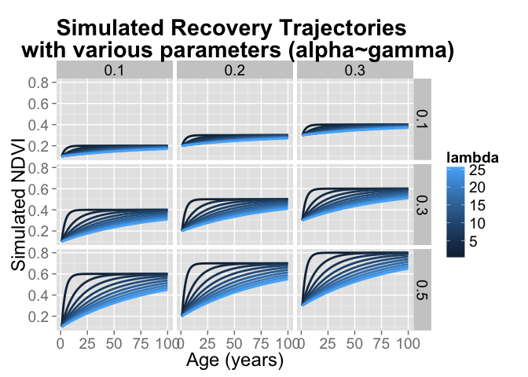

# PostFireTrajectories
Adam M. Wilson  
`r format(Sys.time(), "%d %B, %Y")`  


# Data

Load the model data we made in [DataPrep.R](../1_Data/DataPrep.R)

```r
load("data/modeldata.Rdata")
rv_meta=read.csv("data/vegtypecodes.csv")
sdat$vegn=rv_meta$code[match(sdat$veg,rv_meta$ID)]

## now create a single monster table with all the data
dat=cbind.data.frame(tdatl,sdat[match(tdatl$id,sdat$id),])
## drop negative ages (time before first fire) for now
dat=dat[dat$age>=0,]
## look at the table
kable(head(dat),row.names=F)
```


|    id| year| age|   ndvi|    id|      x|       y| veg| cover|  tmax|  tmin|   dem|   tpi|vegn                         |
|-----:|----:|---:|------:|-----:|------:|-------:|---:|-----:|-----:|-----:|-----:|-----:|:----------------------------|
| 83925| 2000|   0| 0.3845| 83925| 260445| 6243525|  18|     1| 28.19| 9.413| 152.5| 7.934|Peninsula Shale Renosterveld |
| 83925| 2001|   1| 0.5050| 83925| 260445| 6243525|  18|     1| 28.19| 9.413| 152.5| 7.934|Peninsula Shale Renosterveld |
| 83925| 2002|   2| 0.6160| 83925| 260445| 6243525|  18|     1| 28.19| 9.413| 152.5| 7.934|Peninsula Shale Renosterveld |
| 83925| 2003|   3| 0.4260| 83925| 260445| 6243525|  18|     1| 28.19| 9.413| 152.5| 7.934|Peninsula Shale Renosterveld |
| 83925| 2004|   4| 0.6460| 83925| 260445| 6243525|  18|     1| 28.19| 9.413| 152.5| 7.934|Peninsula Shale Renosterveld |
| 83925| 2005|   5| 0.6435| 83925| 260445| 6243525|  18|     1| 28.19| 9.413| 152.5| 7.934|Peninsula Shale Renosterveld |


## Change through time

It's still hard to see change while looking at the full peninsula, so let's:

1. pick a few pixels and plot NDVI as a function of time.  
2. zoom in on a smaller region

Let's load the NDVI data again.

```r
## load the NDVI data
ndvifile="data/ndvi_annual_landsat_30m.tif"
nyears=1984:2014
ndvi=stack(ndvifile)
names(ndvi)=paste0("ndvi_",nyears)
ndvi=setZ(ndvi,nyears)
```

But first we need to pick a pixel (or a few) to plot.  There are a few ways to do this.  First let's try extracting values from a few cells:

```r
## first plot the data
plot(ndvi[[1]])
## select a few points by row number
d=data.frame(cell=c(1095098,1070102,1006689))
points(sdat[match(d$cell,sdat$id),c("x","y")],pch=16)
text(sdat[match(d$cell,sdat$id),c("x","y")],labels=d$cell,pos=4)
```

 

To select points for plotting, we can use the `click` function (in Raster) that allows you to pick points on the map.  First we need to plot the data using the plot() command. Then run the `click` command using the `ig` grid so the cell id's are returned. 

```r
## first plot the data
plot(ndvi[[1]])
## specify how many points you want to select
nclicks=5
## run the click function then click on the map (to the right).  This may not work in GUI's other than RStudio...
d=click(ig,n=nclicks,cell=T,id=T)
```


Now plot that as a function of time (year).

```r
ggplot(dat[dat$id%in%d$cell,],
       aes(x=year,y=ndvi,group=id))+
  geom_line(aes(color = factor(id)),size=1,linetype=id)
```

 

And as a function of age

```r
ggplot(dat[dat$id%in%d$cell,],
       aes(x=age,y=ndvi,group=id))+
  geom_line(aes(color = factor(id)),size=1)+
  stat_smooth(fill = "grey50",aes(group = 1),col="red")
```

```
## geom_smooth: method="auto" and size of largest group is <1000, so using loess. Use 'method = x' to change the smoothing method.
```

```
## Warning: Removed 1 rows containing missing values (stat_smooth).
```

 

  Explore the NDVI data for various pixels by changing `nclicks` above and selecting new points on the map.  Remember that we subsetted the dat dataframe to include only 'natural vegetation' so you may select a point with no data.  

### Regional plot

Alternatively, we can aggregate the data from a larger region.  First import a shapefile of the reserves on the peninsula and the fire data.

```r
## load the reserve shapefile
reserves=readOGR(paste0(datadir,"raw/reserves/"),"reserves")
reserves=spTransform(reserves,CRS(proj4string(ig)))

## or pick a fire polygon
fi=readOGR(dsn=paste0(datadir,"raw/Fire"), layer="CapePenFires") #Cape Peninsula fires history layers 1962-2007
```

```
## Warning: Z-dimension discarded
```

```r
## transform to working projection
fi=spTransform(fi,CRS(proj4string(ig)))
```

Now select a region to explore.  You could do a single fire, a single reserve, or any combination of regions using the code below.  

```r
## select a reserve
resname="SILVERMINE"
reg1=reserves[which(reserves$MASTERNAME==resname),]

## or pick a fire
#reg1=fi[which(fi$FIREID==2000103),]
## get cell numbers in that region

## Extract the data for that polygon
rd=extract(ig,reg1)[[1]]


ggplot(sdat[sdat$id%in%rd,], aes(x=x,y=y))+
   geom_tile(aes(fill=dem))
```

 

Let's look at all those pixels through time:

```r
ggplot(dat[dat$id%in%rd,],aes(x=as.numeric(year),y=ndvi,group=id))+
  geom_line(size=.2,alpha=.1)+
  stat_smooth(fill = "grey50",aes(group = 1),col="red")
```

```
## geom_smooth: method="auto" and size of largest group is >=1000, so using gam with formula: y ~ s(x, bs = "cs"). Use 'method = x' to change the smoothing method.
```

 

And vs. cell age

```r
ggplot(dat[dat$age>=0&dat$id%in%rd,],aes(x=age,y=ndvi,group=id))+
  geom_line(size=.2,alpha=.1)+facet_wrap(~vegn,ncol=1)+
  stat_smooth(fill = "grey50",aes(group = 1),col="red")#+xlim(0, 30)
```

```
## geom_smooth: method="auto" and size of largest group is >=1000, so using gam with formula: y ~ s(x, bs = "cs"). Use 'method = x' to change the smoothing method.
## geom_smooth: method="auto" and size of largest group is >=1000, so using gam with formula: y ~ s(x, bs = "cs"). Use 'method = x' to change the smoothing method.
## geom_smooth: method="auto" and size of largest group is >=1000, so using gam with formula: y ~ s(x, bs = "cs"). Use 'method = x' to change the smoothing method.
## geom_smooth: method="auto" and size of largest group is >=1000, so using gam with formula: y ~ s(x, bs = "cs"). Use 'method = x' to change the smoothing method.
```

 

# Non-linear model fitting

The model I've been using (minus the seasonal component) is:

$\text{NDVI}_{i,t}\sim\mathcal{N}(\mu_{i,t},\sigma)$ 

where $\mu$ is

$\mu_{i,t}=\alpha_i+\gamma_i\Big(1-e^{-\frac{age_{i,t}}{\lambda_i}}\Big)$

# Simulate data
Often the best way to learn about a new model is to simulate data with known properties (parameters), perhaps add some noise, and then try to get those parameters back using the model.  First make a function that simulates a recovery trajectory.

```r
cfun=function(ps,age=x){
  mu=ps[["alpha"]]+ps[["gamma"]]*(1-exp(-age/ps[["lambda"]]))
  sigma=rnorm(length(x),0,ps[["sigma"]])
    return(
      list(
        mu=mu,sigma=sigma,sim=mu+sigma
    ))
  }
```

Now let's use it to make up some _data_.

```r
## Assign recovery parameters
ps=list(
  alpha=.2,
  gamma=.5,
  lambda=4,
  sigma=0.05)

## Assign ages at which to evaluate it
x=seq(0,30,len=100)
## simulate the data (with some noise)
y=cfun(ps)$sim
## and plot it
plot(cfun(ps,x)$sim~x,ylim=c(0,1),pch=16,col="grey",
     ylab="Simulated NDVI",xlab="Years Since Fire")
lines(cfun(ps,x)$mu~x,col="red",lwd=3)
```

 

Feel free to fiddle with the parameters above (alpha, gamma, and lambda) to see what happens and how they vary.  

  What do each of the parameters do?


Now let's explore what the parameters do a little more systematically by making a full 'grid' that covers the reasonable variation of each parameter.

```r
pspace=expand.grid(alpha = seq(0.1,0.3, len = 3),gamma = seq(0.1,0.5, len = 3), lambda = seq(1, 25, len = 10),sigma=0.05)
## limit it to reasonable values (alpha+gamma cannot be >1)
pspace=pspace[(pspace$alpha+pspace$gamma)<1,]
## make a gridded plot
pdata=do.call(rbind.data.frame,lapply(1:nrow(pspace), function(i) cfun(pspace[i,],x)$mu))
colnames(pdata)=x
pdata$id=1:nrow(pspace)
pdatal=melt(pdata,id.var="id")
colnames(pdatal)=c("id","age","ndvi")
pdatal$age=as.numeric(pdatal$age)
pdatal[,c("alpha","gamma","lambda","sigma")]=pspace[pdatal$id,]
```


```r
ggplot(pdatal,aes(x=age,y=ndvi,group=lambda,colour=lambda))+
   geom_line(size=1)+
  facet_grid(gamma~alpha)+
  labs(y="Simulated NDVI",x="Age (years)")+
  theme(plot.title = element_text(lineheight=.8, face="bold"))+
  ggtitle("Simulated Recovery Trajectories \n with various parameters (alpha~gamma)")
```

 

Remember the formula?

$\mu_{i,t}=\alpha_i+\gamma_i\Big(1-e^{-\frac{age_{i,t}}{\lambda_i}}\Big)$

Since this is a slightly more complicated formula than a standard linear regression, we can't just use `lm`/`glm`, etc.  There are a few approaches to fitting this model.  We'll start with a numeric search for values that minimize the residual squared errors using the `nlsLM()` function in the `minpack.lm` package.  First we need to define the model in as a 'formula


```r
form=as.formula(y~alpha+gamma*(1-exp(-x/lambda)))
```

Then set up some model fitting settings, such as the lower and upper bounds of reasonable values.  


```r
## Assign starting values for all parameters.  The search has to start somewhere...
start=list(alpha=0.2,gamma=0.4,lambda=4)
## define lower and upper bounds for the parameters to limit the search
lower=c(0,0,0)
upper=c(1,1,10)
## other nls control settings
ctl=nls.control(maxiter = 150,minFactor=1e-10)
## Assign ages at which to evaluate the model
x=seq(0,30,len=100)
```

Now let's pick some parameters, simulate some data, and see if we can get the parameters back again.  Let's recreate a single dataset again.


```r
## Set recovery parameters
ps=list(
  alpha=.2,
  gamma=.5,
  lambda=4,
  sigma=0.05)

## simulate the data (with some noise)
y=cfun(ps,x)$sim

## run nlsLM
m <- nlsLM(form, data =list(x=x,y=y), start = start, trace = T,control=ctl,lower=lower,upper=upper)
```

Look at the model object.

```r
summary(m)
```

```
## 
## Formula: y ~ alpha + gamma * (1 - exp(-x/lambda))
## 
## Parameters:
##        Estimate Std. Error t value Pr(>|t|)    
## alpha    0.2084     0.0264    7.89  4.5e-12 ***
## gamma    0.4916     0.0258   19.05  < 2e-16 ***
## lambda   3.7126     0.3480   10.67  < 2e-16 ***
## ---
## Signif. codes:  0 '***' 0.001 '**' 0.01 '*' 0.05 '.' 0.1 ' ' 1
## 
## Residual standard error: 0.0488 on 97 degrees of freedom
## 
## Number of iterations to convergence: 4 
## Achieved convergence tolerance: 1.49e-08
```

Now summarize the _true_ and _estimated_ values:


```r
kable(cbind(True=unlist(ps)[1:3],Estimated=coef(m)))
```


|       |   True| Estimated|
|:------|------:|---------:|
|alpha  | 0.2000|    0.2084|
|gamma  | 0.5000|    0.4916|
|lambda | 4.0000|    3.7126|

And plot the simulated (noisy) data with the fitted value.


```r
plot(y~x,col="grey",pch=16,ylab="Simulated NDVI",xlab="Age (time since fire)",main="Simulated data with fitted curve",las=1)
lines(fitted(m)~x,col="red", lwd=4)
```

 

     Now explore changing the parameters (in the `ps` object) and seeing if the model is able to recover the right values.  How does it vary when you increase _sigma_?

# Check out the _real_ data!

## Create a subset
To make things run faster while we're experimenting, let's subset the data,  For example, drop ages before the first fire (which are censored and uncertain), keep only fires in SILVERMINE, and select only "Peninsula Granite Fynbos - South"


Let's look at that timeseries for all points in the subsetted region.  

```r
dats=dat[dat$vegn=="Peninsula Granite Fynbos - South"&dat$id%in%rd,] 

ggplot(dats,aes(x=age,y=ndvi,group=id))+
  geom_line(size=.2,alpha=.2)
```

 

Woah, that's messy.  Could there be any information there?  Let's see what happens when we fit all pixels at once.


```r
sform=as.formula(ndvi~alpha+gamma*(1-exp(-age/lambda)))
m <- nlsLM(sform, data =dats, start = start, trace = T,control=ctl,lower=lower,upper=upper)
summary(m)
```

Plot it:


```r
## make a new dataframe of predictions from the model
dpred=cbind.data.frame(ndvi=predict(m,newdata=data.frame(age=x)),age=x,id=1)

ggplot(dats,aes(x=age,y=ndvi,group=id))+
  geom_line(size=.2,alpha=.2)+
  geom_line(data=dpred,aes(y=ndvi,x=age),colour="red",size=2)
```

 

Do you believe it?  Useful?  How to improve upon this approach?  What other factors are important?


