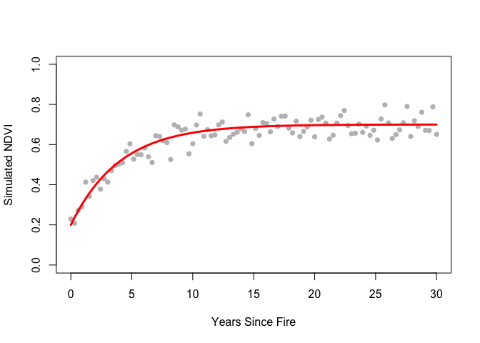

# Simulated Recovery
Adam M. Wilson  
`r format(Sys.time(), "%B %d, %Y")`  


# Non-linear model fitting

The full model I've been using (minus the seasonal component) says that the expected NDVI at some location $i$ in time $t$ comes from a normal distribution as follows:

$\text{NDVI}_{i,t}\sim\mathcal{N}(\mu_{i,t},\sigma)$ 

where the mean ($\mu$) is a nonlinear function including the post-fire NDVI value ($\alpha$), the potential increase in NDVI ($\gamma$), and the post-fire recovery rate ($\lambda$) as follows:

$\mu_{i,t}=\alpha_i+\gamma_i\Big(1-e^{-\frac{age_{i,t}}{\lambda_i}}\Big)$


# Simulate data
Often the best way to learn about a new model is to simulate data with known properties (parameters), perhaps add some noise, and then try to get those parameters back using the model.  First make a function that simulates a recovery trajectory.

```r
cfun=function(ps,age=x){
  mu=ps[["alpha"]]+ps[["gamma"]]*(1-exp(-age/ps[["lambda"]]))
  sigma=rnorm(length(x),0,ps[["sigma"]])
    return(
      list(
        mu=mu,sigma=sigma,sim=mu+sigma
    ))
  }
```

Now let's use it to make up some _"data"_.

```r
## Assign recovery parameters
ps=list(
  alpha=.2,
  gamma=.5,
  lambda=4,
  sigma=0.05)

## Assign ages at which to evaluate it
x=seq(0,30,len=100)
## simulate the data (with some noise)
y=cfun(ps)$sim
## and plot it
plot(cfun(ps,x)$sim~x,ylim=c(0,1),pch=16,col="grey",
     ylab="Simulated NDVI",xlab="Years Since Fire")
lines(cfun(ps,x)$mu~x,col="red",lwd=3)
```

 

Feel free to fiddle with the parameters above (alpha, gamma, and lambda) to see what happens and how they vary.  

  What do each of the parameters do?


Now let's explore what the parameters do a little more systematically by making a matrix of parameter space including all reasonable variation.

```r
pspace=expand.grid(alpha = seq(0.1,0.3, len = 3),gamma = seq(0.1,0.5, len = 3), lambda = seq(1, 25, len = 10),sigma=0.05)
## limit it to reasonable values (alpha+gamma cannot be >1)
pspace=pspace[(pspace$alpha+pspace$gamma)<1,]
## make a gridded plot
pdata=do.call(rbind.data.frame,lapply(1:nrow(pspace), function(i) cfun(pspace[i,],x)$mu))
colnames(pdata)=x
pdata$id=1:nrow(pspace)
pdatal=melt(pdata,id.var="id")
colnames(pdatal)=c("id","age","ndvi")
pdatal$age=as.numeric(pdatal$age)
pdatal[,c("alpha","gamma","lambda","sigma")]=pspace[pdatal$id,]
```


```r
ggplot(pdatal,aes(x=age,y=ndvi,group=lambda,colour=lambda))+
   geom_line(size=1)+
  facet_grid(gamma~alpha)+
  labs(y="Simulated NDVI",x="Age (years)")+
  theme(plot.title = element_text(lineheight=.8, face="bold"))+
  ggtitle("Simulated Recovery Trajectories \n with various parameters (alpha~gamma)")
```

 

Remember the formula?

$\mu_{i,t}=\alpha_i+\gamma_i\Big(1-e^{-\frac{age_{i,t}}{\lambda_i}}\Big)$

Since this is a slightly more complicated formula than a standard linear regression, we can't just use `lm`/`glm`, etc.  There are a few approaches to fitting this model.  We'll start with a numeric search (the _Levenberg-Marquardt_ algorithm) for values that minimize the residual squared errors with the `nlsLM()` function in the `minpack.lm` package. First we need to define the model in as a 'formula


```r
form=as.formula(y~alpha+gamma*(1-exp(-x/lambda)))
```

Then set up some model fitting settings, such as the lower and upper bounds of reasonable values.  


```r
## Assign starting values for all parameters.  The search has to start somewhere...
start=list(alpha=0.2,gamma=0.4,lambda=4)
## define lower and upper bounds for the parameters to limit the search
lower=c(0,0,0)
upper=c(1,1,10)
## other nls control settings
ctl=nls.control(maxiter = 150,minFactor=1e-10)
## Assign ages at which to evaluate the model
x=seq(0,30,len=100)
```

Now let's pick some parameters, simulate some data, and see if we can get the parameters back again.  Let's recreate a single dataset again.


```r
## Set recovery parameters
ps=list(
  alpha=.2,
  gamma=.5,
  lambda=4,
  sigma=0.05)

## simulate the data (with some noise)
y=cfun(ps,x)$sim

## run nlsLM
m <- nlsLM(form, data =list(x=x,y=y), start = start, trace = T,control=ctl,lower=lower,upper=upper)
```

Look at the model object.

```r
summary(m)
```

```
## 
## Formula: y ~ alpha + gamma * (1 - exp(-x/lambda))
## 
## Parameters:
##        Estimate Std. Error t value Pr(>|t|)    
## alpha    0.1412     0.0290    4.86  4.5e-06 ***
## gamma    0.5570     0.0284   19.62  < 2e-16 ***
## lambda   3.6705     0.3331   11.02  < 2e-16 ***
## ---
## Signif. codes:  0 '***' 0.001 '**' 0.01 '*' 0.05 '.' 0.1 ' ' 1
## 
## Residual standard error: 0.0535 on 97 degrees of freedom
## 
## Number of iterations to convergence: 4 
## Achieved convergence tolerance: 1.49e-08
```

Now summarize the _true_ and _estimated_ values:


```r
kable(cbind(True=unlist(ps)[1:3],Estimated=coef(m)))
```


|       |   True| Estimated|
|:------|------:|---------:|
|alpha  | 0.2000|    0.1412|
|gamma  | 0.5000|    0.5570|
|lambda | 4.0000|    3.6705|

And plot the simulated (noisy) data with the fitted value.


```r
plot(y~x,col="grey",pch=16,ylab="Simulated NDVI",xlab="Age (time since fire)",main="Simulated data with fitted curve",las=1)
lines(fitted(m)~x,col="red", lwd=4)
```

 

     Now explore changing the parameters (in the `ps` object) and seeing if the model is able to recover the right values.  How does it vary when you increase $\sigma$?


