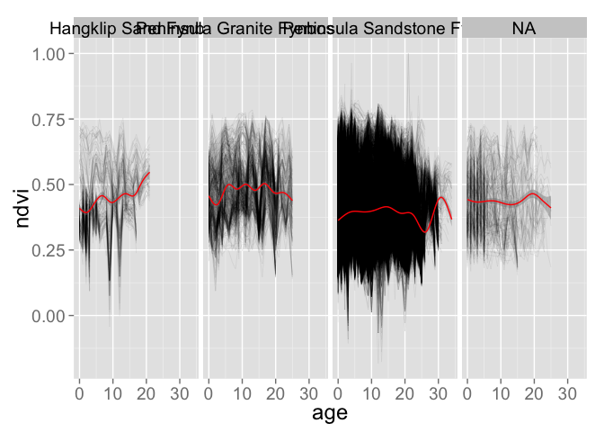

# PostFireTrajectories
Adam M. Wilson  
`r format(Sys.time(), "%B %d, %Y")`  


# Data

Load the model data we made in [DataPrep.R](../3_DataAnnual/DataPrep.Rmd)

```r
load("data/modeldata_annual.Rdata")
rv_meta=read.csv("data/vegtypecodes.csv")
sdat$vegn=rv_meta$code[match(sdat$veg,rv_meta$ID)]

## now create a single monster table with all the data
dat=cbind.data.frame(tdat,sdat[match(tdat$id,sdat$id),])
## drop negative ages (time before first fire) for now
dat=dat[dat$age>=0,]
## look at the table
kable(head(dat),row.names=F)
```


|    id| year| age|   ndvi|    id|      x|       y| veg| cover|  tmax|  tmin| janrad| julrad| aspect|   dem|   tpi| firecount|vegn                         |
|-----:|----:|---:|------:|-----:|------:|-------:|---:|-----:|-----:|-----:|------:|------:|------:|-----:|-----:|---------:|:----------------------------|
| 83925| 2000|   0| 0.3845| 83925| 260445| 6243525|  18|     1| 28.19| 9.413|   8902|   3029|  2.135| 152.5| 7.934|         1|Peninsula Shale Renosterveld |
| 83925| 2001|   1| 0.5050| 83925| 260445| 6243525|  18|     1| 28.19| 9.413|   8902|   3029|  2.135| 152.5| 7.934|         1|Peninsula Shale Renosterveld |
| 83925| 2002|   2| 0.6160| 83925| 260445| 6243525|  18|     1| 28.19| 9.413|   8902|   3029|  2.135| 152.5| 7.934|         1|Peninsula Shale Renosterveld |
| 83925| 2003|   3| 0.4260| 83925| 260445| 6243525|  18|     1| 28.19| 9.413|   8902|   3029|  2.135| 152.5| 7.934|         1|Peninsula Shale Renosterveld |
| 83925| 2004|   4| 0.6460| 83925| 260445| 6243525|  18|     1| 28.19| 9.413|   8902|   3029|  2.135| 152.5| 7.934|         1|Peninsula Shale Renosterveld |
| 83925| 2005|   5| 0.6435| 83925| 260445| 6243525|  18|     1| 28.19| 9.413|   8902|   3029|  2.135| 152.5| 7.934|         1|Peninsula Shale Renosterveld |


## Change through time

It's still hard to see change while looking at the full peninsula, so let's:

1. pick a few pixels and plot NDVI as a function of time.  
2. zoom in on a smaller region

Let's load the NDVI data again.

```r
## load the NDVI data
ndvifile="data/ndvi_annual_landsat_30m.tif"
years=1984:2014
ndvi=stack(ndvifile)
names(ndvi)=paste0("ndvi_",years)
ndvi=setZ(ndvi,years)
```

But first we need to pick a pixel (or a few) to plot.  There are a few ways to do this.  First let's try extracting values from a few cells:

```r
## first plot the data
plot(ndvi[[1]])
## select a few points by row number
d=data.frame(cell=c(1095098,1070102,1006689))
points(sdat[match(d$cell,sdat$id),c("x","y")],pch=16)
text(sdat[match(d$cell,sdat$id),c("x","y")],labels=d$cell,pos=4)
```

 

To select points for plotting, we can use the `click` function (in Raster) that allows you to pick points on the map.  First we need to plot the data using the plot() command. Then run the `click` command using the `ig` grid so the cell id's are returned. 

```r
## first plot the data
plot(ndvi[[2]])
## specify how many points you want to select
nclicks=5
## run the click function then click on the map (to the right).  This may not work in GUI's other than RStudio...
d=click(ig,n=nclicks,cell=T,id=T)
```


Now plot that as a function of time (year).

```r
ggplot(dat[dat$id%in%d$cell,],
       aes(x=year,y=ndvi,group=id))+
  geom_line(aes(color = factor(id)),size=1,linetype=id)
```

```
## Warning: Removed 6 rows containing missing values (geom_path).
```

 

And as a function of age

```r
ggplot(dat[dat$id%in%d$cell,],
       aes(x=age,y=ndvi,group=id))+
  geom_line(aes(color = factor(id)),size=1)+
  stat_smooth(fill = "grey50",aes(group = 1),col="red")
```

```
## geom_smooth: method="auto" and size of largest group is <1000, so using loess. Use 'method = x' to change the smoothing method.
```

```
## Warning: Removed 7 rows containing missing values (stat_smooth).
## Warning: Removed 2 rows containing missing values (geom_path).
```

 

  Explore the NDVI data for various pixels by changing `nclicks` above and selecting new points on the map.  Remember that we subsetted the dat dataframe to include only 'natural vegetation' so you may select a point with no data.  

### Regional plot

Alternatively, we can aggregate the data from a larger region.  First import a shapefile of the reserves on the peninsula and the fire data.

```r
## load the reserve shapefile
reserves=readOGR(paste0(datadir,"raw/reserves/"),"reserves")
reserves=spTransform(reserves,CRS(proj4string(ig)))

## or pick a fire polygon
fi=readOGR(dsn=paste0(datadir,"raw/Fire"), layer="CapePenFires") #Cape Peninsula fires history layers 1962-2007
```

```
## Warning: Z-dimension discarded
```

```r
## transform to working projection
fi=spTransform(fi,CRS(proj4string(ig)))
```

Now select a region to explore.  You could do a single fire, a single reserve, or any combination of regions using the code below.  

```r
## select a reserve
resname="SILVERMINE"
reg1=reserves[which(reserves$MASTERNAME==resname),]

## or pick a fire
#reg1=fi[which(fi$FIREID==2000103),]
## get cell numbers in that region

## Extract the data for that polygon
rd=extract(ig,reg1)[[1]]


ggplot(sdat[sdat$id%in%rd,], aes(x=x,y=y))+
   geom_tile(aes(fill=dem))
```

 

Let's look at all those pixels through time:

```r
ggplot(dat[dat$id%in%rd,],aes(x=as.numeric(year),y=ndvi,group=id))+
  geom_line(size=.2,alpha=.1)+
  stat_smooth(fill = "grey50",aes(group = 1),col="red")+
  coord_fixed(ratio = 80)
```

```
## geom_smooth: method="auto" and size of largest group is >=1000, so using gam with formula: y ~ s(x, bs = "cs"). Use 'method = x' to change the smoothing method.
```

 

And vs. cell age

```r
ggplot(dat[dat$age>=0&dat$id%in%rd,],aes(x=age,y=ndvi,group=id))+
  geom_line(size=.2,alpha=.1)+facet_wrap(~vegn,nrow=1)+
  stat_smooth(fill = "grey50",aes(group = 1),col="red")#+xlim(0, 30)
```

```
## geom_smooth: method="auto" and size of largest group is >=1000, so using gam with formula: y ~ s(x, bs = "cs"). Use 'method = x' to change the smoothing method.
## geom_smooth: method="auto" and size of largest group is >=1000, so using gam with formula: y ~ s(x, bs = "cs"). Use 'method = x' to change the smoothing method.
## geom_smooth: method="auto" and size of largest group is >=1000, so using gam with formula: y ~ s(x, bs = "cs"). Use 'method = x' to change the smoothing method.
## geom_smooth: method="auto" and size of largest group is >=1000, so using gam with formula: y ~ s(x, bs = "cs"). Use 'method = x' to change the smoothing method.
```

 

# Non-linear model fitting

The full model I've been using (minus the seasonal component) says that the expected NDVI at some location $i$ in time $t$ comes from a normal distribution as follows:

$\text{NDVI}_{i,t}\sim\mathcal{N}(\mu_{i,t},\sigma)$ 

where the mean ($\mu$) is a nonlinear function including the post-fire NDVI value ($\alpha$), the potential increase in NDVI ($\gamma$), and the post-fire recovery rate ($\lambda$) as follows:

$\mu_{i,t}=\alpha_i+\gamma_i\Big(1-e^{-\frac{age_{i,t}}{\lambda_i}}\Big)$

## Create a subset
To make things run faster while we're experimenting, let's subset the data,  For example, drop ages before the first fire (which are censored and uncertain), keep only fires in SILVERMINE, and select only "Peninsula Sandstone Fynbos"


Let's look at that timeseries for all points in the subsetted region.  

```r
dats=dat[dat$vegn=="Peninsula Sandstone Fynbos"&dat$id%in%rd,] 
dats=dats[!is.na(dats$id),]

ggplot(dats,aes(x=age,y=ndvi,group=id))+
  geom_line(size=.1,alpha=.1)
```

```
## Warning: Removed 14320 rows containing missing values (geom_path).
```

 

Woah, that's messy.  Could there be any information there?  Let's see what happens when we fit all pixels at once.


```r
## Assign starting values for all parameters.  The search has to start somewhere...
start=list(alpha=0.2,gamma=0.4,lambda=4)
## define lower and upper bounds for the parameters to limit the search
lower=c(0,0,0)
upper=c(1,1,10)
## other nls control settings
ctl=nls.control(maxiter = 150,minFactor=1e-10)
## Assign ages at which to evaluate the model
x=seq(0,30,len=100)


sform=as.formula(ndvi~alpha+gamma*(1-exp(-age/lambda)))
m <- nlsLM(sform, data =dats, start = start, trace = T,control=ctl,lower=lower,upper=upper)
summary(m)
```

Plot it:


```r
## make a new dataframe of predictions from the model
dpred=cbind.data.frame(ndvi=predict(m,newdata=data.frame(age=x)),age=x,id=1)

ggplot(dats,aes(x=age,y=ndvi,group=id))+
  geom_line(size=.2,alpha=.2)+
  geom_line(data=dpred,aes(y=ndvi,x=age),colour="red",size=2)
```

```
## Warning: Removed 14320 rows containing missing values (geom_path).
```

 

Do you believe it?  Useful?  How to improve upon this approach?  What other factors are important?


