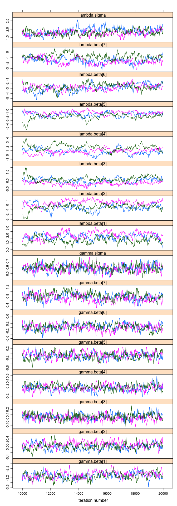

# Modeling PostFireTrajectories
Adam M. Wilson  
`r format(Sys.time(), "%B %d, %Y")`  


# Data

Load the model data we made in [DataPrep.R](../1_Data/DataPrep.R)

```r
load("data/modeldata_annual.Rdata")
rv_meta=read.csv("data/vegtypecodes.csv")
sdat$vegn=rv_meta$code[match(sdat$veg,rv_meta$ID)]
rownames(sdat)=sdat$id

## clip tdat to include only 1984:2006 due to missing recent fire data
tdat=tdat[tdat$year%in%1984:2006,]
```

We know have two data frames we'll use in the modeling. The first is the spatial data:

```r
kable(head(sdat),row.names=F)
```


|    id|      x|       y| veg| cover|  tmax|   tmin| janrad| julrad| aspect|   dem|   tpi| firecount|vegn                         |
|-----:|------:|-------:|---:|-----:|-----:|------:|------:|------:|------:|-----:|-----:|---------:|:----------------------------|
| 83925| 260445| 6243525|  18|     1| 28.19|  9.413|   8902|   3029|  2.135| 152.5| 7.934|         1|Peninsula Shale Renosterveld |
| 84598| 260415| 6243495|  18|     1| 28.40|  9.556|   8781|   2562|  3.223| 150.5| 7.260|         1|Peninsula Shale Renosterveld |
| 84599| 260445| 6243495|  18|     1| 28.19|  9.459|   8789|   2686|  2.612| 149.6| 6.183|         1|Peninsula Shale Renosterveld |
| 84600| 260475| 6243495|  18|     1| 28.52|  9.779|   8515|   2454|  2.170| 146.9| 5.759|         1|Peninsula Shale Renosterveld |
| 84601| 260505| 6243495|  18|     1| 28.79| 10.022|   8331|   2112|  2.421| 138.2| 5.770|         1|Peninsula Shale Renosterveld |
| 85271| 260385| 6243465|  18|     1| 28.50|  9.714|   8619|   2274|  2.930| 139.8| 5.918|         3|Peninsula Shale Renosterveld |

And the second is the temporal data:

```r
kable(head(tdat),row.names=F)
```


|    id| year| age|   ndvi|
|-----:|----:|---:|------:|
| 83925| 1984| -23| 0.2790|
| 83925| 1985| -24| 0.5820|
| 83925| 1986| -25| 0.4830|
| 83925| 1987| -26| 0.3160|
| 83925| 1988| -27| 0.3080|
| 83925| 1989| -28| 0.4155|


```r
## subset to only two fynbos veg types
n=500
sid=c(
  sample(which(sdat$vegn=="Peninsula Sandstone Fynbos"),n),
  sample(which(sdat$vegn=="Peninsula Granite Fynbos - North"),n),
  sample(which(sdat$vegn=="Hangklip Sand Fynbos"),n)
)
sdat=sdat[sid,]

#drop obs of unknown age or ndvi or with no data in sdat
tdat=tdat[!is.na(tdat$age)&
          !is.na(tdat$ndvi)&
          tdat$id%in%sdat$id
          ,] 

## drop negative ages (time before first fire) for now
tdat=tdat[tdat$age>=0,]
```

## Subsample Data

```r
#### Set model name for naming objects below and create directory to hold output
mname=substr(
  system(" git log --pretty=format:%H | head -n 1",intern=T),
  1,8)

mname="v1"

if(!file.exists(paste("output/",mname,sep=""))) dir.create(paste("output/",mname,sep=""),recursive=T)

### subset dataset
holdout=0.50  #percent to hold out for validation
s=sort(sample(unique(sdat$id),round(length(unique(sdat$id))*(1-holdout)))); length(s)
```

```
## [1] 750
```

```r
write.csv(s,paste("output/",mname,"/",mname,"_subset.csv",sep=""),row.names=F)
sdat$subset=factor(ifelse(sdat$id%in%unique(tdat$id),ifelse(sdat$id%in%s,"Model Fitting","Validation"),"Prediction"),levels=c("Model Fitting","Validation","Prediction"),ordered=T)
```

## Create dummy variables for vegetation (and any other factors) 

```r
sdat$veg=as.factor(sdat$veg)
lm1=lm(dem~veg,data=sdat)
tveg=model.matrix(lm1)[,-1]

kable(head(tveg))
```


|       | veg14| veg16|
|:------|-----:|-----:|
|714121 |     0|     1|
|713339 |     0|     1|
|975631 |     0|     1|
|743051 |     0|     1|
|272501 |     0|     1|
|930558 |     0|     1|


```r
## Select and scale environmental data
envars=c("dem","tpi","tmax","tmin")

scaled=scale(as.matrix(sdat[,envars]))
env_full=cbind(intercept=1,scaled,tveg)

### Save the scaling parameters to convert fitted coefficients back to metric units later
beta.mu=c(intercept=0,attr(scaled,"scaled:center"),
        rep(0,ncol(tveg)))
beta.sd=c(intercept=1,attr(scaled,"scaled:scale"),rep(1,ncol(tveg)))
rm(scaled)  #drop the scaled data
```


## Create model data

```r
tdat_full=tdat
tdat=tdat[tdat$id%in%s,]; gc() 
```

```
##           used (Mb) gc trigger  (Mb)  max used  (Mb)
## Ncells 1250380 66.8    2251281 120.3   2251281 120.3
## Vcells 1642380 12.6   69325578 529.0 108189981 825.5
```

```r
## create two env frames for fitting and prediction
env=env_full[rownames(env_full)%in%s,]
  
### Drop missing values
omit=unique(tdat$id)[as.numeric(which(is.na(apply(env,1,sum))))]; omit
```

```
## numeric(0)
```

```r
if(length(omit)>0){
  env=env[!rownames(env)%in%omit,]
  tdat=tdat[!tdat$id%in%omit,]
}

## create new id that goes from 1 to nGrid
tdat$id2=as.integer(as.factor(tdat$id)); gc()
```

```
##           used (Mb) gc trigger  (Mb)  max used  (Mb)
## Ncells 1250482 66.8    2251281 120.3   2251281 120.3
## Vcells 1654189 12.7   55460462 423.2 108189981 825.5
```

```r
## Get counts
nGrid=length(unique(tdat$id))            ;nGrid
```

```
## [1] 727
```

```r
nTime=length(unique(tdat$year))          ;nTime
```

```
## [1] 23
```

```r
nBeta=ncol(env)                          ;nBeta
```

```
## [1] 7
```

```r
## Write data object
data=list(
  age=tdat$age,
  ndvi=tdat$ndvi,
  id=tdat$id2,
  nObs=nrow(tdat),
  env=env,
  nGrid=nGrid,
  nBeta=nBeta
  )

## Function to generate initial values
gen.inits=function(nGrid,nBeta) { list(
  ## spatial terms
  alpha=runif(nGrid,0.1,0.5),
  gamma=runif(nGrid,0.1,.9),
  lambda=runif(nGrid,0.2,1),
  ## spatial means
  alpha.mu=runif(1,0.1,0.2),
  ## priors  
  gamma.beta=runif(nBeta,0,1),
  gamma.tau=runif(1,1,5),
  alpha.tau=runif(1,1,5),
  lambda.beta=runif(nBeta,0,2),
  lambda.tau=runif(1,0,2),
  tau=runif(1,0,2)
  )
}

## list of parameters to monitor (save)
params=c("gamma.beta","gamma.sigma","alpha",
         "alpha.mu","alpha.sigma","lambda.beta","lambda.sigma")

### Save all data into Rdata object for model fitting
save(data,gen.inits,s,sdat,beta.mu,beta.sd,envars,env_full,tdat_full,
     file=paste("output/",mname,"/",mname,"_inputdata.Rdata",sep="")) 
```


# JAGS

```r
foutput=paste0("output/",mname,"/",mname,"_modeloutput.Rdata")

if(!file.exists(foutput)){

  write.table(paste("Starting model ",mname," on ",date()),
            paste0("output/",mname,"ModelStart.txt"))

  ## test compilation
  t1=system.time(m <<- jags.model(file="workflow/6_Modeling/Model.R",
                             data=data,
                             inits=gen.inits(data$nGrid,data$nBeta),
                             n.chains=3,n.adapt=10000))
  t2=system.time(mc <<- coda.samples(m,params,n.iter=10000))

  save(m,mc,beta.mu,beta.sd,file=foutput)  
}
```

Model Summaries

```r
if(!exists("mc")) load(foutput)

## Potentially thin the data
mc2=window(mc,thin=20,start=1)
```

```
## Warning: start value not changed
## Warning: start value not changed
## Warning: start value not changed
```

```r
### Extract regression coefficients
mc_reg=mc2[,grep("gamma[.]|lambda[.]",colnames(mc[[1]]))]

xyplot(mc_reg)
```

 

```r
densityplot(mc_reg)
```

 


```r
### Calculate convergence metrics
## Autocorrelation
ac=melt(autocorr.diag(mc_reg,lags=seq(0,200,5))); 
ac$Var1=as.numeric(do.call(rbind,strsplit(as.character(ac$Var1)," "))[,2])
colnames(ac)=c("Lag","Parameter","value")
```

Summarize parameter values:

```r
kable(summary(mc_reg)[[2]])
```


|               |    2.5%|     25%|     50%|     75%|   97.5%|
|:--------------|-------:|-------:|-------:|-------:|-------:|
|gamma.beta[1]  | -3.3625| -3.1954| -3.0960| -2.9973| -2.8201|
|gamma.beta[2]  | -0.2023| -0.0228|  0.0748|  0.1713|  0.3653|
|gamma.beta[3]  | -0.0570|  0.0196|  0.0559|  0.0977|  0.1732|
|gamma.beta[4]  | -0.0902|  0.0557|  0.1318|  0.2106|  0.3709|
|gamma.beta[5]  | -0.3468| -0.1910| -0.0916| -0.0009|  0.1763|
|gamma.beta[6]  | -0.3256| -0.1014|  0.0211|  0.1432|  0.3409|
|gamma.beta[7]  |  0.4433|  0.6434|  0.7532|  0.8600|  1.0774|
|gamma.sigma    |  0.4803|  0.5486|  0.5855|  0.6232|  0.6972|
|lambda.beta[1] |  0.6736|  1.2907|  1.7154|  2.0810|  2.6778|
|lambda.beta[2] | -1.8408| -0.6153| -0.1719|  0.3561|  1.1372|
|lambda.beta[3] | -0.1572|  0.2119|  0.4362|  0.6770|  1.1171|
|lambda.beta[4] | -0.3089|  0.6161|  1.0954|  1.6482|  2.8175|
|lambda.beta[5] | -3.0966| -1.8248| -1.2857| -0.8328| -0.2008|
|lambda.beta[6] | -4.0651| -3.1174| -2.6702| -2.2501| -1.4741|
|lambda.beta[7] | -2.6411| -1.8216| -1.3458| -0.8684|  0.0754|
|lambda.sigma   |  1.5039|  1.6889|  1.8006|  1.9326|  2.2041|

```r
names(beta.mu)
```

[1] "intercept" "dem"       "tpi"       "tmax"      "tmin"      ""         
[7] ""         
