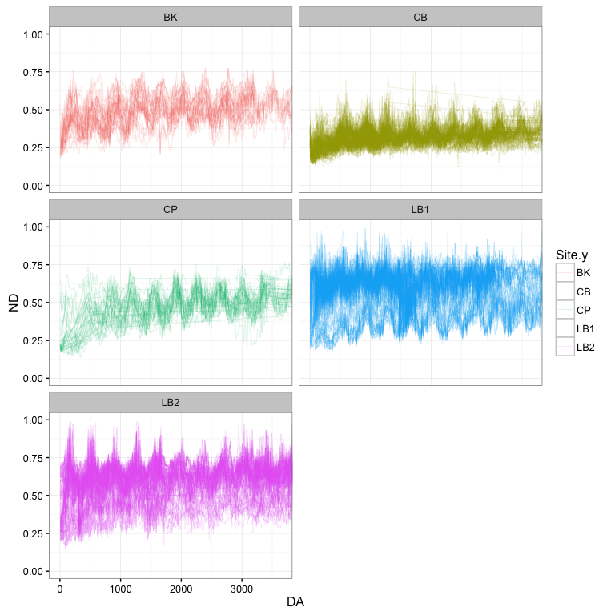

# DataPrep for plot data
Jasper Slingsby, Adam M. Wilson and Glenn Moncrieff  
`r format(Sys.time(), '%d %B, %Y')`  


This script assembles various environmental layers into a common 250m grid for the CFR and extracts data for specific plots for which community trait data is available.  It also calculates veg age based on the fire data.

## Index raster
Import raster of an index grid (`ig`) to spatially connect all the datasets.

```r
igfile = paste0(datadir,"/clean/indexgrid_modis_250m.grd")

if(!file.exists(igfile)) {
  
igraster=raster(nrows=1069,ncols=2362,xmn=243750, xmx=834250, ymn=6183250 , ymx=6450500,crs = "+proj=utm +zone=34 +south +datum=WGS84 +units=m +no_defs +ellps=WGS84 +towgs84=0,0,0", vals=1:2524978)

writeRaster(igraster,igfile)
}
ig <- raster(igfile)
```


## traits_plots 

Assemble plot data


```r
traitraw = read.csv(paste0(datadir,"raw/Traits_plots/Comm_Plot_Lat_Lon_Coords.csv"),stringsAsFactors=FALSE)
climraw = read.csv(paste0(datadir,"raw/Traits_plots/Comm_Plot_Climate.csv"), stringsAsFactors=FALSE)

sites = c("CP","LB1","LB2","CB","BK","HK")

site_loc = data.frame(traitraw$Longitude,traitraw$Latitude,traitraw$Site,traitraw$PLOT)
site_loc = site_loc[complete.cases(site_loc),]

names(site_loc) <- c("Lon","Lat","Site","PLOT")

site_loc = filter(site_loc,Site%in%sites)

site_locsp = SpatialPointsDataFrame(site_loc[,1:2], site_loc[3:4], 
                proj4string = CRS("+proj=longlat +datum=WGS84 +no_defs +ellps=WGS84 +towgs84=0,0,0"))
                    
# reproject to the CRS of the modis index grid (UTM 34S)
site_locsp=spTransform(site_locsp,CRS(proj4string(ig)))
```

## Fire data
Assemble fire data. Data comes from threee different sources: MODIS, CapeNature, and TMNP.

```r
#cape Pen
######
ficp=readOGR(dsn=paste0(datadir,"raw/Fire"), layer="TMNP_fires_1962_2016") #Cape Peninsula fires history layers 1962-2016
```

```
## OGR data source with driver: ESRI Shapefile 
## Source: "/Users/glennmoncrieff/Dropbox/Postfire_workshop/Data/raw/Fire", layer: "TMNP_fires_1962_2016"
## with 694 features
## It has 7 fields
```

```r
#format dates
cpdate=as.Date(ficp@data$STARTDATE,format="%Y%m%d")%>%as.character%>%as.data.frame
names(cpdate)="Date"
ficp@data=cpdate

ficp=spTransform(ficp,CRS(proj4string(ig)))

#modis
#####
fibk=readOGR(dsn=paste0(datadir,"raw/Fire"), layer="bkloof_fires_clean",stringsAsFactors = F) #baviaanskloof fires history layers 2000-2016 from modis
```

```
## OGR data source with driver: ESRI Shapefile 
## Source: "/Users/glennmoncrieff/Dropbox/Postfire_workshop/Data/raw/Fire", layer: "bkloof_fires_clean"
## with 722 features
## It has 2 fields
```

```r
#format dates
yorigin = as.Date(paste0(fibk@data$year,"0101"),format="%Y%m%d")
bkdate = as.Date(as.numeric(fibk@data$burn_day)-1, origin = yorigin) %>% as.character %>% as.data.frame
names(bkdate)="Date"
fibk@data=bkdate

#transform
fibk=spTransform(fibk,CRS(proj4string(ig)))

#CapeNature
##########
ficn=readOGR(dsn=paste0(datadir,"raw/Fire"), layer="All_fires_15_16_gw",stringsAsFactors = F) #cape nature fires history layers
```

```
## OGR data source with driver: ESRI Shapefile 
## Source: "/Users/glennmoncrieff/Dropbox/Postfire_workshop/Data/raw/Fire", layer: "All_fires_15_16_gw"
## with 3719 features
## It has 16 fields
```

```r
#format dates
cndate=as.Date(ficn@data$Datestart,format="%Y/%m/%d")%>%as.character%>%as.data.frame
names(cndate)="Date"
ficn@data=cndate

ficn=spTransform(ficn,CRS(proj4string(ig)))

#####
#combine

ficn <- spChFIDs(ficn, paste("CapeNature", row.names(ficn), sep="."))
ficp <- spChFIDs(ficp, paste("TMNP", row.names(ficp), sep="."))
fibk <- spChFIDs(fibk, paste("MODIS", row.names(fibk), sep="."))
fi=rbind(ficn,ficp,fibk)
fi=fi[!is.na(fi$Date),]
```


### Rasterize fire data into annual fire maps 

```r
## Set up a "Days since 1 January 1927" column on the fire polygons
sdate=fi$Date #get the unique list of years in which fires occurred
sdate=as.numeric(as.Date(as.character(sdate), format="%Y-%m-%d")-as.Date("1927-01-01", format="%Y-%m-%d"))
fi$Day=sdate
sdate=sort(unique(sdate))


#############

#if we want to aviod rasterization:
rdf_sp=over(site_locsp,fi,returnList = TRUE)
```


### Calculate veg age from fire history
Now we have an object `rdf` (rasterized fires) with one band/layer for each fire with 0s and the number of days since 1 January 1927 indicating whether that pixel burned in that fire. We can use that to calculate the time since fire for each modis scene by subtracting each raster from each date and taking the minimum positive value for each cell across all rasters. Unburnt cells are given the same age (number of days since 1927-01-01) as the scene.


Here is the method to do it without rasterizing fires:


```r
## Get the vector of modis tile dates
tdate_mod=read.csv(paste(datadir,"raw/NDVI/MOD_dates.csv", sep=""), header=F, stringsAsFactors=F)
tdate=as.numeric(as.Date(tdate_mod[,1]) - as.Date("19270101", format="%Y%m%d"))

#function to calculate age of each site for a given day
fage_sp=function(x, z)
  {
  y=NA
  if(nrow(z)>0){
   if(min(z)<=x){  
      y=x-z
      y=min(y[y>=0],na.rm=T)
   }
  }
  return(y)
}

#function to calculate age of a site all modis days
agesite=function(x,k,y) {
  #get fire days
  firesday=y[[x]][2]
  #get age for all days
  age=sapply(k,fage_sp,z=firesday)
  return(age)
}

fffile="/Users/glennmoncrieff/Documents/Projects/postfire/postfire/data/fire_age_sp.Rdata"
if(!file.exists(fffile)) {

#run for each site in paralell
tseq=1:nrow(site_loc)
parsites <- foreach(site=1:nrow(site_loc),.combine=cbind)
fdate <- parsites %dopar% agesite(site,tdate,rdf_sp)
fdate <- t(fdate)%>%as.data.frame
names(fdate) <-  paste0("DAT_",format(as.Date(tdate_mod[,1], format="%Y-%m-%d"), "%Y%m.%d"))

save(fdate,file=fffile)
}
load(fffile)
```


## NDVI Compositing


```r
getNDVI=function(file,datefile,prefix){
  ndvi=stack(paste0(datadir,"raw/NDVI/",file))
  NAvalue(ndvi)=-3000
offs(ndvi)=0
gain(ndvi)=.0001
dates=as.Date(read.csv(paste0(datadir,"raw/NDVI/",datefile),header=F)[,1])
names(ndvi)=paste0(prefix,sub("-","",dates))
ndvi=setZ(ndvi,dates)
}

getQA=function(file,datefile,prefix){
  ndvi=stack(paste0(datadir,"raw/NDVI/",file))
  NAvalue(ndvi)=-1
offs(ndvi)=0
gain(ndvi)=1
dates=as.Date(read.csv(paste0(datadir,"raw/NDVI/",datefile),header=F)[,1])
names(ndvi)=paste0(prefix,sub("-","",dates))
ndvi=setZ(ndvi,dates)
}
```

Now use the function to read in the data and add the relevant metadata.

```r
mNDVI=getNDVI(file="2016096_MODIS_v1g_DIM_MOD_NDVI.tif",
           datefile="MOD_dates.csv",prefix="NDVI_")
mEVI=getNDVI(file="2016096_MODIS_v1g_DIM_MOD_EVI.tif",
           datefile="MOD_dates.csv",prefix="EVI_")
mQ=getQA(file="2016096_MODIS_v1g_DIM_MOD_SummaryQA.tif",
           datefile="MOD_dates.csv",prefix="QA_")
```

Let's check out one of the MODIS objects.  Raster provides a summary by just typing the object's name:

```r
mNDVI
```

```
## class       : RasterStack 
## dimensions  : 1069, 2362, 2524978, 380  (nrow, ncol, ncell, nlayers)
## resolution  : 250, 250  (x, y)
## extent      : 243750, 834250, 6183250, 6450500  (xmin, xmax, ymin, ymax)
## coord. ref. : +proj=utm +zone=34 +south +datum=WGS84 +units=m +no_defs +ellps=WGS84 +towgs84=0,0,0 
## names       : NDVI_200002.18, NDVI_200003.05, NDVI_200003.21, NDVI_200004.06, NDVI_200004.22, NDVI_200005.08, NDVI_200005.24, NDVI_200006.09, NDVI_200006.25, NDVI_200007.11, NDVI_200007.27, NDVI_200008.12, NDVI_200008.28, NDVI_200009.13, NDVI_200009.29, ... 
## min values  :        -3.2768,        -3.2768,        -3.2768,        -3.2768,        -3.2768,        -3.2768,        -3.2768,        -3.2768,        -3.2768,        -3.2768,        -3.2768,        -3.2768,        -3.2768,        -3.2768,        -3.2768, ... 
## max values  :         3.2767,         3.2767,         3.2767,         3.2767,         3.2767,         3.2767,         3.2767,         3.2767,         3.2767,         3.2767,         3.2767,         3.2767,         3.2767,         3.2767,         3.2767, ... 
## time        : 2000-02-18 - 2016-08-12 (range)
```

We have NDVI, EVI and a data quality index (QA). 
There are several ways these data could be combined.  
Today, we'll simply combine (stack) all the available observations for each pixel.  


```r
tl=melt(list(mN=getZ(mNDVI),mE=getZ(mEVI),mQ=getZ(mQ)))
ndates=unique(tl$value)
## write that to disk for later use
write.table(ndates,file="data/ndates.csv",row.names=F,col.names=F,sep=",")

### concatenate all sensors to a single raster stack (this just links the filenames)
undvi=stack(mNDVI,mEVI,mQ)
undvi=setZ(undvi,c(getZ(mNDVI),getZ(mEVI),getZ(mQ)))
### Sort them by date (z)
ndvi=undvi[[order(getZ(undvi))]]

ndvifile="/Users/glennmoncrieff/Documents/Projects/postfire/postfire/data/ndvi_dim_mod.Rdata"
if(!file.exists(ndvifile)){
save(ndvi,file="ndvi_dim_mod.Rdata")
# ## create a new ndvi layer
# ndvifile="data/ndvi_landsat_30m.tif"
# if(!file.exists(ndvifile)){
# writeRaster(ndvi,filename=ndvifile)
# }
# ## load it
# ndvi=raster(ndvifile)
  
}
load(ndvifile)
```


# Data Compilation
## load spatial data masking

Here we select the subset of cells that we will explore further.  In this case it is the plot for which we have trait data. You can fiddle with these settings to include fewer (or more) cells.  If your computer is slow, you may want to subset this further. Then we use these plot location to extract environemtal data, and finally join these data with the data for plot-level trait means.


```r
#join climate data
climdat=read.csv(paste0(datadir,"raw/Traits_plots/Comm_Plot_Climate.csv"), stringsAsFactors=FALSE)
tempdat=site_locsp@data
tempdat$plot_smpl=paste0(tempdat$Site,"_",tempdat$PLOT)
tempdat=left_join(tempdat,climdat,by="plot_smpl")
site_locsp@data=tempdat

## load data for masking	
mask=ig
maskids=raster::extract(mask,site_locsp,cellnumbers=TRUE)
site_locsp=raster::extract(mask,site_locsp,cellnumbers=TRUE,sp=T)
maskids=maskids[,1]
maskdata = cbind(seq(1:length(maskids)),site_locsp@data[,1:3],maskids)
names(maskdata)=c("plot","site","plot_num","plot_long","maskid")

##load spatial data
#adam data for soil and veg
adam <- stack(paste0(datadir, "clean/adam_data.grd"))

#glenn data for schultze climate
glenn <- stack(paste0(datadir, "clean/schultze.grd"))
names(glenn) <- c("map","mmp1","mmp7","pcv","apan","tmax01","tmin07")

#load radiation data
raddec21 <- raster(paste0(datadir, "clean/rad_21dec.grd"))
radjun21 <- raster(paste0(datadir, "clean/rad_21jun.grd"))
rad <- stack(raddec21,radjun21)

#load traits data
trait_cwm <- read.csv(file=paste0(datadir, "clean/traits_cwm.csv"))

#load landsat cv data
avcov <- read.csv(file=paste0(datadir, "clean/LE7_avcov.csv"))

### Make a dataframe of all spatial data
## Beware, this approach will only work if your data are all in identical projection/grid/etc.

#extract spatial data
sdatwd="/Users/glennmoncrieff/Documents/Projects/postfire/postfire/data/sdat_moddim.Rdata"	

if(!file.exists(sdatwd)){	
#temporally invariant data              
sdat=data.frame(
  id=raster::extract(ig, maskids),
  coordinates(ig)[maskids,],
  raster::extract(adam, maskids),
  raster::extract(glenn, maskids),
  raster::extract(rad, maskids)
)

sdat<-cbind(sdat,site_locsp@data[,1:7])
sdat$plot=1:nrow(sdat)
sdat <- left_join(sdat,trait_cwm,by = c("plot_smpl" = "PlotSite"))
sdat <- left_join(sdat,avcov,by = c("plot" = "PLOT"))

save(sdat,file=sdatwd)	
}	

load(sdatwd)	
```

## Reshape temporal data
It's often easier to work with data in 'long' format where there is one row for each observation and another column indicating what the observation is.  Let's `melt` the data to 'long' format.

```r
#add IDs to fireage data frame
fdate <- cbind(maskids,fdate)

#extract ndvi dat
ftdatw="/Users/glennmoncrieff/Documents/Projects/postfire/postfire/data/tdatw_moddim.Rdata"	
if(!file.exists(ftdatw)){	
  	
tdatw=data.frame(	
  id=raster::extract(ig, maskids),
  raster::extract(ndvi,maskids),
  fdate
  )	

save(tdatw,file=ftdatw)	
}	

load(ftdatw)	
#tdatw[1:10,1:10]

#we have some plots in the same pixel (same maskid)
#df with ids and maskids
idplot=data.frame(plot=1:nrow(tdatw),maskid=tdatw$id)
#list the duplicate pixels:
idcount=as.data.frame(table(tdatw$id))
idup=filter(idcount,Freq>1)
pdup=filter(idplot,maskid%in%idup$Var1)

#create data table
#listed by plots, no maskids
tdatw$plot=1:nrow(tdatw)
tdatw=select(tdatw,-id)
tdatl=melt(tdatw,id.var="plot")%>%filter(variable!="maskids")
tdatl$variable=as.character(tdatl$variable)%>%as.factor
tdatln=cbind.data.frame(lab=levels(tdatl$variable),
                     do.call(rbind,strsplit(as.character(levels(tdatl$variable)),"_")))
tdatln$type=ifelse(tdatln[,"1"]%in%c("NDVI","EVI","QA"),"modis","age")

tdatl[,c("type","date")]=tdatln[match(tdatl$variable,tdatln$lab),4:3]
tdatl$miss=paste(substr(as.character(tdatl$variable), 1, 2))

#bugger we have some pixels with multiple plots...
#for now...just drop those plots/pixels
# idcount=as.data.frame(table(maskids))
# iddup=filter(idcount,Freq==1)
# tdatld=filter(tdatl,id %in% iddup$maskids)

tdats=select(tdatl,-c(variable,type))
tdat=spread(tdats,miss,value)
tdat=left_join(tdat,maskdata,by="plot")

#tdat=dcast(tdatld,id+date~miss,value.var="value")
## convert date to proper format
n = 5 #where to insert separator

tdat$date=paste(substr(as.character(tdat$date), 1, 5-1), ".", substr(as.character(tdat$date), n, nchar(as.character(tdat$date))), sep = "")
## convert year from a factor to numeric
tdat$date=as.Date(as.character(tdat$date),"%Y.%m.%d")

kable(head(tdat))
```


 plot  date           DA       EV       ND   QA  site   plot_num   plot_long     maskid
-----  -----------  ----  -------  -------  ---  -----  ---------  ----------  --------
    1  2000-02-18     33   0.0000   0.0000    0  CP     1          CP_1         2255768
    1  2000-03-05     49   0.0000   0.0000    0  CP     1          CP_1         2255768
    1  2000-03-21     65   0.0000   0.0000    0  CP     1          CP_1         2255768
    1  2000-04-06     81   0.1146   0.1754    0  CP     1          CP_1         2255768
    1  2000-04-22     97   0.0000   0.0000    0  CP     1          CP_1         2255768
    1  2000-05-08    113   0.0000   0.0000    0  CP     1          CP_1         2255768

Save it as an R data object for later use.

```r
## drop the 'wide' version
save(sdat,tdat,file="data/modeldata_dim.Rdata")
```

Some of our fires are incorrectly dated. We are only able to correct this after inspecting the data. Run this code chunk to fix this problem:


##Inspect the data

Lets look at the data frame, and then plot some fire recovery curves

```r
## drop the 'wide' version
plotdat <- left_join(tdat,sdat,by="plot")

plotsites <- c("CP","LB1","LB2","CB","BK")
plotdat_temp <- filter(plotdat,Site.y%in%plotsites)%>%
                filter(QA==0)%>%filter(ND>0) %>%filter(complete.cases(.))

#look at the data
glimpse(plotdat_temp)
```

```
## Observations: 161,346
## Variables: 98
## $ plot                <int> 2, 2, 2, 2, 2, 2, 2, 2, 2, 2, 2, 2, 2, 2, ...
## $ date                <date> 2000-02-18, 2000-03-05, 2000-04-06, 2000-...
## $ DA                  <dbl> 33, 49, 81, 97, 145, 273, 289, 337, 383, 4...
## $ EV                  <dbl> 0.1547, 0.1230, 0.1310, 0.1233, 0.1307, 0....
## $ ND                  <dbl> 0.2247, 0.2305, 0.2056, 0.1885, 0.2090, 0....
## $ QA                  <dbl> 0, 0, 0, 0, 0, 0, 0, 0, 0, 0, 0, 0, 0, 0, ...
## $ site                <fctr> CP, CP, CP, CP, CP, CP, CP, CP, CP, CP, C...
## $ plot_num.x          <fctr> 2, 2, 2, 2, 2, 2, 2, 2, 2, 2, 2, 2, 2, 2,...
## $ plot_long           <chr> "CP_2", "CP_2", "CP_2", "CP_2", "CP_2", "C...
## $ maskid              <dbl> 2253410, 2253410, 2253410, 2253410, 225341...
## $ id                  <dbl> 2253410, 2253410, 2253410, 2253410, 225341...
## $ x                   <dbl> 259125, 259125, 259125, 259125, 259125, 25...
## $ y                   <dbl> 6211875, 6211875, 6211875, 6211875, 621187...
## $ aspect              <dbl> 149.8309, 149.8309, 149.8309, 149.8309, 14...
## $ dem                 <dbl> 33.46078, 33.46078, 33.46078, 33.46078, 33...
## $ slope               <dbl> 5.694791, 5.694791, 5.694791, 5.694791, 5....
## $ soilfert            <dbl> 1, 1, 1, 1, 1, 1, 1, 1, 1, 1, 1, 1, 1, 1, ...
## $ soiltext            <dbl> 4, 4, 4, 4, 4, 4, 4, 4, 4, 4, 4, 4, 4, 4, ...
## $ soilph              <dbl> 1, 1, 1, 1, 1, 1, 1, 1, 1, 1, 1, 1, 1, 1, ...
## $ transformed         <dbl> 0.266524, 0.266524, 0.266524, 0.266524, 0....
## $ fynbos              <dbl> 1, 1, 1, 1, 1, 1, 1, 1, 1, 1, 1, 1, 1, 1, ...
## $ soilhighfert        <dbl> 0, 0, 0, 0, 0, 0, 0, 0, 0, 0, 0, 0, 0, 0, ...
## $ soilfinetext        <dbl> 0, 0, 0, 0, 0, 0, 0, 0, 0, 0, 0, 0, 0, 0, ...
## $ soilacid            <dbl> 1, 1, 1, 1, 1, 1, 1, 1, 1, 1, 1, 1, 1, 1, ...
## $ map                 <dbl> 682.306, 682.306, 682.306, 682.306, 682.30...
## $ mmp1                <dbl> 14.12535, 14.12535, 14.12535, 14.12535, 14...
## $ mmp7                <dbl> 99.72899, 99.72899, 99.72899, 99.72899, 99...
## $ pcv                 <dbl> 441.7835, 441.7835, 441.7835, 441.7835, 44...
## $ apan                <dbl> 1898.903, 1898.903, 1898.903, 1898.903, 18...
## $ tmax01              <dbl> 23.86345, 23.86345, 23.86345, 23.86345, 23...
## $ tmin07              <dbl> 8.382595, 8.382595, 8.382595, 8.382595, 8....
## $ radtot_21dec        <dbl> 9401.356, 9401.356, 9401.356, 9401.356, 94...
## $ radtot_21jun        <dbl> 3325.712, 3325.712, 3325.712, 3325.712, 33...
## $ Site.x              <fctr> CP, CP, CP, CP, CP, CP, CP, CP, CP, CP, C...
## $ PLOT.x              <fctr> 2, 2, 2, 2, 2, 2, 2, 2, 2, 2, 2, 2, 2, 2,...
## $ plot_smpl           <chr> "CP_2", "CP_2", "CP_2", "CP_2", "CP_2", "C...
## $ lat                 <dbl> -34.20683, -34.20683, -34.20683, -34.20683...
## $ lon                 <dbl> 18.38435, 18.38435, 18.38435, 18.38435, 18...
## $ region              <chr> "CP", "CP", "CP", "CP", "CP", "CP", "CP", ...
## $ plot_num.y          <chr> "2", "2", "2", "2", "2", "2", "2", "2", "2...
## $ X.x                 <int> 225, 225, 225, 225, 225, 225, 225, 225, 22...
## $ seasonally_apparent <dbl> 0.001794836, 0.001794836, 0.001794836, 0.0...
## $ deciduous           <dbl> 0.001794836, 0.001794836, 0.001794836, 0.0...
## $ resprout_postfire   <dbl> 0.4257214, 0.4257214, 0.4257214, 0.4257214...
## $ serotinous          <dbl> 0.01359934, 0.01359934, 0.01359934, 0.0135...
## $ max_height_cm       <dbl> 93.14027, 93.14027, 93.14027, 93.14027, 93...
## $ herb                <dbl> 0.04521607, 0.04521607, 0.04521607, 0.0452...
## $ geophyte            <dbl> 0.009664504, 0.009664504, 0.009664504, 0.0...
## $ graminoid           <dbl> 0.4014221, 0.4014221, 0.4014221, 0.4014221...
## $ low_shrub           <dbl> 0.3341157, 0.3341157, 0.3341157, 0.3341157...
## $ mid_shrub           <dbl> 0.1069999, 0.1069999, 0.1069999, 0.1069999...
## $ tall_shrub          <dbl> 0.1024437, 0.1024437, 0.1024437, 0.1024437...
## $ succulent           <dbl> 0.102927, 0.102927, 0.102927, 0.102927, 0....
## $ tree                <dbl> 0, 0, 0, 0, 0, 0, 0, 0, 0, 0, 0, 0, 0, 0, ...
## $ BranchingOrder      <dbl> 2.020287, 2.020287, 2.020287, 2.020287, 2....
## $ Height_cm           <dbl> 50.02745, 50.02745, 50.02745, 50.02745, 50...
## $ LeafLength_cm       <dbl> 13.23283, 13.23283, 13.23283, 13.23283, 13...
## $ AvgLeafWidth_cm     <dbl> 0.3398653, 0.3398653, 0.3398653, 0.3398653...
## $ LeafThickness_mm    <dbl> 0.8471172, 0.8471172, 0.8471172, 0.8471172...
## $ SLA                 <dbl> 52.19043, 52.19043, 52.19043, 52.19043, 52...
## $ LMA                 <dbl> 0.03191556, 0.03191556, 0.03191556, 0.0319...
## $ FWC                 <dbl> 2.001748, 2.001748, 2.001748, 2.001748, 2....
## $ LeafSucculence      <dbl> 0.04406234, 0.04406234, 0.04406234, 0.0440...
## $ Leaf_DMC            <dbl> 0.4025955, 0.4025955, 0.4025955, 0.4025955...
## $ LWR                 <dbl> 73.13953, 73.13953, 73.13953, 73.13953, 73...
## $ CanopyArea          <dbl> 1792.134, 1792.134, 1792.134, 1792.134, 17...
## $ percent_N           <dbl> 0.8361731, 0.8361731, 0.8361731, 0.8361731...
## $ percent_C           <dbl> 46.00725, 46.00725, 46.00725, 46.00725, 46...
## $ C_to_N_ratio        <dbl> 70.90005, 70.90005, 70.90005, 70.90005, 70...
## $ std_cor_d_13C_12C   <dbl> -26.81245, -26.81245, -26.81245, -26.81245...
## $ IRIDACEAE           <dbl> 0.005936767, 0.005936767, 0.005936767, 0.0...
## $ THYMELAEACEAE       <dbl> 0.00828386, 0.00828386, 0.00828386, 0.0082...
## $ ROSACEAE            <dbl> 0, 0, 0, 0, 0, 0, 0, 0, 0, 0, 0, 0, 0, 0, ...
## $ RUTACEAE            <dbl> 0.00414193, 0.00414193, 0.00414193, 0.0041...
## $ POACEAE             <dbl> 0.02726771, 0.02726771, 0.02726771, 0.0272...
## $ CYPERACEAE          <dbl> 0.06212895, 0.06212895, 0.06212895, 0.0621...
## $ PROTEACEAE          <dbl> 0.01359934, 0.01359934, 0.01359934, 0.0135...
## $ FABACEAE            <dbl> 0.126674, 0.126674, 0.126674, 0.126674, 0....
## $ ERICACEAE           <dbl> 0.0176032, 0.0176032, 0.0176032, 0.0176032...
## $ RESTIONACEAE        <dbl> 0.3120254, 0.3120254, 0.3120254, 0.3120254...
## $ ASTERACEAE          <dbl> 0.2032997, 0.2032997, 0.2032997, 0.2032997...
## $ high_flam           <dbl> 0.7744719, 0.7744719, 0.7744719, 0.7744719...
## $ low_flam            <dbl> 0.1259837, 0.1259837, 0.1259837, 0.1259837...
## $ med_flam            <dbl> 0.09940632, 0.09940632, 0.09940632, 0.0994...
## $ culm_stem_leaf      <dbl> 0.2008836, 0.2008836, 0.2008836, 0.2008836...
## $ leaf_leaf           <dbl> 0.6119011, 0.6119011, 0.6119011, 0.6119011...
## $ mixed_leaf          <dbl> 0.1870772, 0.1870772, 0.1870772, 0.1870772...
## $ none_leaf           <dbl> 0, 0, 0, 0, 0, 0, 0, 0, 0, 0, 0, 0, 0, 0, ...
## $ longevity0          <dbl> 0.002070965, 0.002070965, 0.002070965, 0.0...
## $ longevity1          <dbl> 0.1874223, 0.1874223, 0.1874223, 0.1874223...
## $ longevity2          <dbl> 0.7541074, 0.7541074, 0.7541074, 0.7541074...
## $ longevity4          <dbl> 0.05626122, 0.05626122, 0.05626122, 0.0562...
## $ Site.y              <fctr> CP, CP, CP, CP, CP, CP, CP, CP, CP, CP, C...
## $ PLOT.y              <int> 2, 2, 2, 2, 2, 2, 2, 2, 2, 2, 2, 2, 2, 2, ...
## $ Latitude            <dbl> -34.20683, -34.20683, -34.20683, -34.20683...
## $ Longitude           <dbl> 18.38435, 18.38435, 18.38435, 18.38435, 18...
## $ X.y                 <int> 2, 2, 2, 2, 2, 2, 2, 2, 2, 2, 2, 2, 2, 2, ...
## $ avgcov              <dbl> 0.1126405, 0.1126405, 0.1126405, 0.1126405...
```

```r
P <- ggplot(plotdat_temp,aes(x=DA, y=ND,color=Site.y,group=plot)) +
geom_line(size=0.05) +
coord_cartesian(ylim=c(0,1),xlim=c(0,3650)) +
#scale_color_manual(values=c("grey60")) +
facet_wrap( ~ region, ncol=2) +
theme_bw() 
 
suppressWarnings(print(P))
```

<!-- -->


