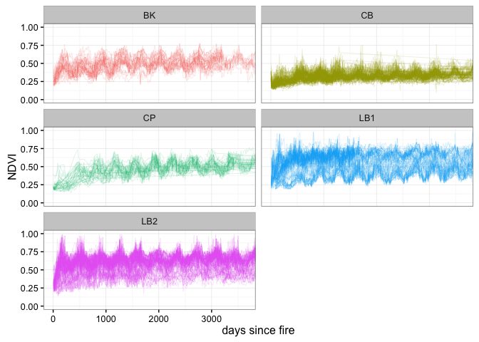
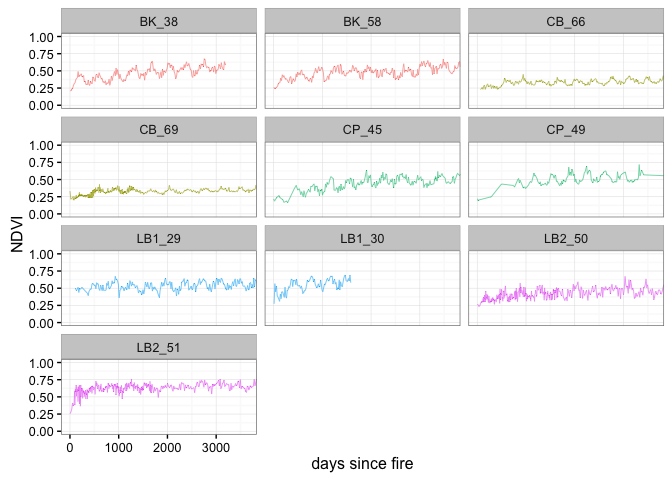
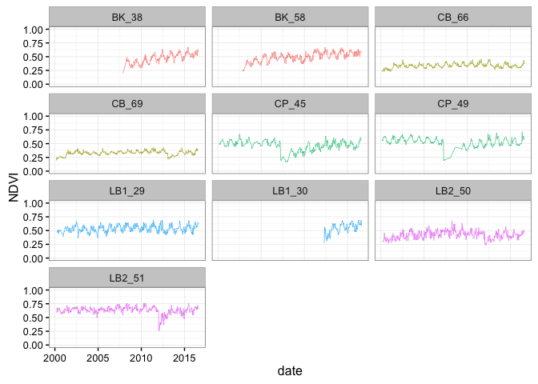
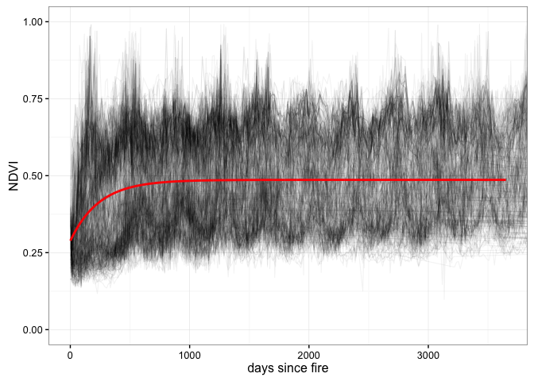
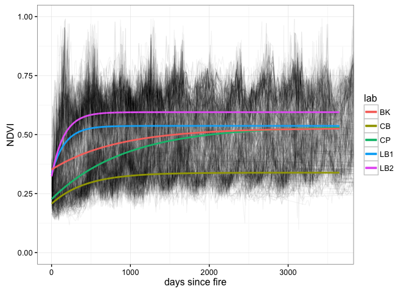

# PostFireTrajectories and Model Prep for plot data
Jasper Slingsby, Adam M. Wilson and Glenn Moncrieff  
`r format(Sys.time(), "%B %d, %Y")`  


# Data

Load the model data we made in DataPrepFullRecord_plots.R

```r
load("data/modeldata_dim_fix.Rdata")

plotdat <- left_join(tdat,sdat,by="plot")

#site we want to keep
plotsites <- c("CP","LB1","LB2","CB","BK")
dat <- filter(plotdat,Site.y%in%plotsites)%>% #filter site
                filter(QA==0)%>%filter(ND>0) %>%filter(complete.cases(.)) #filter low quality and nodata

kable(head(dat),row.names=F)
```


 plot  date           DA       EV       ND   QA  site   plot_num.x   plot_long     maskid        id        x         y     aspect        dem      slope   soilfert   soiltext   soilph   transformed   fynbos   soilhighfert   soilfinetext   soilacid       map       mmp1       mmp7        pcv       apan     tmax01     tmin07   radtot_21dec   radtot_21jun  Site.x   PLOT.x   plot_smpl          lat        lon  region   plot_num.y    X.x   seasonally_apparent   deciduous   resprout_postfire   serotinous   max_height_cm        herb    geophyte   graminoid   low_shrub   mid_shrub   tall_shrub   succulent   tree   BranchingOrder   Height_cm   LeafLength_cm   AvgLeafWidth_cm   LeafThickness_mm        SLA         LMA        FWC   LeafSucculence    Leaf_DMC        LWR   CanopyArea   percent_N   percent_C   C_to_N_ratio   std_cor_d_13C_12C   IRIDACEAE   THYMELAEACEAE   ROSACEAE    RUTACEAE     POACEAE   CYPERACEAE   PROTEACEAE   FABACEAE   ERICACEAE   RESTIONACEAE   ASTERACEAE   high_flam    low_flam    med_flam   culm_stem_leaf   leaf_leaf   mixed_leaf   none_leaf   longevity0   longevity1   longevity2   longevity4  Site.y    PLOT.y    Latitude   Longitude   X.y      avgcov
-----  -----------  ----  -------  -------  ---  -----  -----------  ----------  --------  --------  -------  --------  ---------  ---------  ---------  ---------  ---------  -------  ------------  -------  -------------  -------------  ---------  --------  ---------  ---------  ---------  ---------  ---------  ---------  -------------  -------------  -------  -------  ----------  ----------  ---------  -------  -----------  ----  --------------------  ----------  ------------------  -----------  --------------  ----------  ----------  ----------  ----------  ----------  -----------  ----------  -----  ---------------  ----------  --------------  ----------------  -----------------  ---------  ----------  ---------  ---------------  ----------  ---------  -----------  ----------  ----------  -------------  ------------------  ----------  --------------  ---------  ----------  ----------  -----------  -----------  ---------  ----------  -------------  -----------  ----------  ----------  ----------  ---------------  ----------  -----------  ----------  -----------  -----------  -----------  -----------  -------  -------  ----------  ----------  ----  ----------
    2  2000-02-18     33   0.1547   0.2247    0  CP     2            CP_2         2253410   2253410   259125   6211875   149.8309   33.46078   5.694791          1          4        1      0.266524        1              0              0          1   682.306   14.12535   99.72899   441.7835   1898.903   23.86345   8.382595       9401.356       3325.712  CP       2        CP_2         -34.20683   18.38435  CP       2             225             0.0017948   0.0017948           0.4257214    0.0135993        93.14027   0.0452161   0.0096645   0.4014221   0.3341157   0.1069999    0.1024437    0.102927      0         2.020287    50.02745        13.23283         0.3398653          0.8471172   52.19043   0.0319156   2.001749        0.0440623   0.4025955   73.13953     1792.134   0.8361731    46.00725       70.90005           -26.81245   0.0059368       0.0082839          0   0.0041419   0.0272677     0.062129    0.0135993   0.126674   0.0176032      0.3120254    0.2032997   0.7744719   0.1259837   0.0994063        0.2008836   0.6119011    0.1870772           0     0.002071    0.1874223    0.7541074    0.0562612  CP             2   -34.20683    18.38435     2   0.1126405
    2  2000-03-05     49   0.1230   0.2305    0  CP     2            CP_2         2253410   2253410   259125   6211875   149.8309   33.46078   5.694791          1          4        1      0.266524        1              0              0          1   682.306   14.12535   99.72899   441.7835   1898.903   23.86345   8.382595       9401.356       3325.712  CP       2        CP_2         -34.20683   18.38435  CP       2             225             0.0017948   0.0017948           0.4257214    0.0135993        93.14027   0.0452161   0.0096645   0.4014221   0.3341157   0.1069999    0.1024437    0.102927      0         2.020287    50.02745        13.23283         0.3398653          0.8471172   52.19043   0.0319156   2.001749        0.0440623   0.4025955   73.13953     1792.134   0.8361731    46.00725       70.90005           -26.81245   0.0059368       0.0082839          0   0.0041419   0.0272677     0.062129    0.0135993   0.126674   0.0176032      0.3120254    0.2032997   0.7744719   0.1259837   0.0994063        0.2008836   0.6119011    0.1870772           0     0.002071    0.1874223    0.7541074    0.0562612  CP             2   -34.20683    18.38435     2   0.1126405
    2  2000-04-06     81   0.1310   0.2056    0  CP     2            CP_2         2253410   2253410   259125   6211875   149.8309   33.46078   5.694791          1          4        1      0.266524        1              0              0          1   682.306   14.12535   99.72899   441.7835   1898.903   23.86345   8.382595       9401.356       3325.712  CP       2        CP_2         -34.20683   18.38435  CP       2             225             0.0017948   0.0017948           0.4257214    0.0135993        93.14027   0.0452161   0.0096645   0.4014221   0.3341157   0.1069999    0.1024437    0.102927      0         2.020287    50.02745        13.23283         0.3398653          0.8471172   52.19043   0.0319156   2.001749        0.0440623   0.4025955   73.13953     1792.134   0.8361731    46.00725       70.90005           -26.81245   0.0059368       0.0082839          0   0.0041419   0.0272677     0.062129    0.0135993   0.126674   0.0176032      0.3120254    0.2032997   0.7744719   0.1259837   0.0994063        0.2008836   0.6119011    0.1870772           0     0.002071    0.1874223    0.7541074    0.0562612  CP             2   -34.20683    18.38435     2   0.1126405
    2  2000-04-22     97   0.1233   0.1885    0  CP     2            CP_2         2253410   2253410   259125   6211875   149.8309   33.46078   5.694791          1          4        1      0.266524        1              0              0          1   682.306   14.12535   99.72899   441.7835   1898.903   23.86345   8.382595       9401.356       3325.712  CP       2        CP_2         -34.20683   18.38435  CP       2             225             0.0017948   0.0017948           0.4257214    0.0135993        93.14027   0.0452161   0.0096645   0.4014221   0.3341157   0.1069999    0.1024437    0.102927      0         2.020287    50.02745        13.23283         0.3398653          0.8471172   52.19043   0.0319156   2.001749        0.0440623   0.4025955   73.13953     1792.134   0.8361731    46.00725       70.90005           -26.81245   0.0059368       0.0082839          0   0.0041419   0.0272677     0.062129    0.0135993   0.126674   0.0176032      0.3120254    0.2032997   0.7744719   0.1259837   0.0994063        0.2008836   0.6119011    0.1870772           0     0.002071    0.1874223    0.7541074    0.0562612  CP             2   -34.20683    18.38435     2   0.1126405
    2  2000-06-09    145   0.1307   0.2090    0  CP     2            CP_2         2253410   2253410   259125   6211875   149.8309   33.46078   5.694791          1          4        1      0.266524        1              0              0          1   682.306   14.12535   99.72899   441.7835   1898.903   23.86345   8.382595       9401.356       3325.712  CP       2        CP_2         -34.20683   18.38435  CP       2             225             0.0017948   0.0017948           0.4257214    0.0135993        93.14027   0.0452161   0.0096645   0.4014221   0.3341157   0.1069999    0.1024437    0.102927      0         2.020287    50.02745        13.23283         0.3398653          0.8471172   52.19043   0.0319156   2.001749        0.0440623   0.4025955   73.13953     1792.134   0.8361731    46.00725       70.90005           -26.81245   0.0059368       0.0082839          0   0.0041419   0.0272677     0.062129    0.0135993   0.126674   0.0176032      0.3120254    0.2032997   0.7744719   0.1259837   0.0994063        0.2008836   0.6119011    0.1870772           0     0.002071    0.1874223    0.7541074    0.0562612  CP             2   -34.20683    18.38435     2   0.1126405
    2  2000-10-15    273   0.1435   0.2132    0  CP     2            CP_2         2253410   2253410   259125   6211875   149.8309   33.46078   5.694791          1          4        1      0.266524        1              0              0          1   682.306   14.12535   99.72899   441.7835   1898.903   23.86345   8.382595       9401.356       3325.712  CP       2        CP_2         -34.20683   18.38435  CP       2             225             0.0017948   0.0017948           0.4257214    0.0135993        93.14027   0.0452161   0.0096645   0.4014221   0.3341157   0.1069999    0.1024437    0.102927      0         2.020287    50.02745        13.23283         0.3398653          0.8471172   52.19043   0.0319156   2.001749        0.0440623   0.4025955   73.13953     1792.134   0.8361731    46.00725       70.90005           -26.81245   0.0059368       0.0082839          0   0.0041419   0.0272677     0.062129    0.0135993   0.126674   0.0176032      0.3120254    0.2032997   0.7744719   0.1259837   0.0994063        0.2008836   0.6119011    0.1870772           0     0.002071    0.1874223    0.7541074    0.0562612  CP             2   -34.20683    18.38435     2   0.1126405


## Change through time

lets look at all plots by age - up to 10 year old plots


```r
P <- ggplot(dat,aes(x=DA, y=ND,color=Site.y,group=plot)) +
geom_line(size=0.05) +
coord_cartesian(ylim=c(0,1),xlim=c(0,3650)) +
#scale_color_manual(values=c("grey60")) +
facet_wrap( ~ region, ncol=2) +
labs(x = "days since fire", y = "NDVI") +
scale_colour_discrete(guide = FALSE) +
theme_bw() 
 
suppressWarnings(print(P))
```

<!-- -->

It's still hard to see change while looking at the entire dataset, so let's:

1. pick a few plots and plot NDVI as a function of age  

```r
dat_plotname <- c("LB1_29","LB1_30","LB2_50","LB2_51","CP_45","CP_49","CB_66","CB_69","BK_38","BK_58")

dat_plot <- filter(dat,plot_smpl%in%dat_plotname)

P <- ggplot(dat_plot,aes(x=DA, y=ND,color=Site.y,group=plot)) +
geom_line(size=0.2) +
coord_cartesian(ylim=c(0,1),xlim=c(0,3650)) +
#scale_color_manual(values=c("grey60")) +
facet_wrap( ~ plot_smpl, ncol=3) +
labs(x = "days since fire", y = "NDVI") +
scale_colour_discrete(guide = FALSE) +
theme_bw() 
 
suppressWarnings(print(P))
```

<!-- -->

2.  plot NDVI as a function of date: 

```r
P <- ggplot(dat_plot,aes(x=date, y=ND,color=Site.y,group=plot)) +
geom_line(size=0.2) +
scale_x_date()+
coord_cartesian(ylim=c(0,1)) +
#scale_color_manual(values=c("grey60")) +
facet_wrap( ~ plot_smpl, ncol=3) +
labs(x = "date", y = "NDVI") +
scale_colour_discrete(guide = FALSE) +
theme_bw() 
 
suppressWarnings(print(P))
```

<!-- -->

# Non-linear model fitting

The full model I've been using (minus the seasonal component) says that the expected NDVI at some location $i$ in time $t$ comes from a normal distribution as follows:

$\text{NDVI}_{i,t}\sim\mathcal{N}(\mu_{i,t},\sigma)$ 

where the mean ($\mu$) is a nonlinear function including the post-fire NDVI value ($\alpha$), the potential increase in NDVI ($\gamma$), and the post-fire recovery rate ($\lambda$) as follows:

$\mu_{i,t}=\alpha_i+\gamma_i\Big(1-e^{-\frac{age_{i,t}}{\lambda_i}}\Big)$

#fit model

 Let's see what happens when we fit all pixels at once.


```r
sform=as.formula(ND~alpha+gamma*(1-exp(-DA/lambda)))
m <- nlsLM(sform, data =dat, start = list(lambda=0.1,alpha=0.1,gamma=0.1), trace = T)
summary(m)
```

Plot it:


```r
## make a new dataframe of predictions from the model
x=seq(1:3650)
dpred=data.frame(pred=predict(m,newdata=list(DA=x)),x=x)

P <- ggplot()+
geom_line(data=dat,aes(x=DA,y=ND,group=plot),size=0.4,alpha=0.05) +
geom_line(data=dpred,aes(y=pred,x=x),colour="red",size=1) +
coord_cartesian(ylim=c(0,1),xlim=c(0,3650)) +
#scale_color_manual(values=c("grey60")) +
labs(x = "days since fire", y = "NDVI") +
scale_colour_discrete(guide = FALSE) +
theme_bw() 
 
suppressWarnings(print(P))
```

<!-- -->

fit separate model for each site:


```r
## make a new dataframe of predictions from the model

CP <- filter(dat,Site.y=="CP")
mCP <- nlsLM(sform, data =CP, start = list(lambda=400,alpha=0.4,gamma=0.1), trace = T)
```

```
## It.    0, RSS =    113.659, Par. =        400        0.4        0.1
## It.    1, RSS =    97.4484, Par. =    1554.19   0.236053   0.293816
## It.    2, RSS =    86.4936, Par. =    886.585   0.244291    0.28814
## It.    3, RSS =    86.1759, Par. =    929.213   0.225638   0.309946
## It.    4, RSS =    86.1756, Par. =    932.107   0.226459   0.309243
## It.    5, RSS =    86.1756, Par. =    932.475   0.226518    0.30919
## It.    6, RSS =    86.1756, Par. =    932.521   0.226525   0.309183
```

```r
LB1<- filter(dat,Site.y=="LB1")
mLB1 <- nlsLM(sform, data =LB1, start = list(lambda=400,alpha=0.4,gamma=0.1), trace = T)
```

```
## It.    0, RSS =     742.15, Par. =        400        0.4        0.1
## It.    1, RSS =    700.407, Par. =     200.49   0.407757   0.108437
## It.    2, RSS =    687.094, Par. =    230.761   0.401461   0.135333
## It.    3, RSS =    686.839, Par. =    137.485   0.362714   0.173293
## It.    4, RSS =    685.698, Par. =    188.354   0.346945   0.190395
## It.    5, RSS =    685.682, Par. =    148.477   0.323734   0.212986
## It.    6, RSS =    685.592, Par. =    175.004   0.340581   0.196716
## It.    7, RSS =    685.579, Par. =    160.212   0.328377   0.208602
## It.    8, RSS =     685.57, Par. =    169.824   0.334658   0.202534
## It.    9, RSS =    685.568, Par. =    164.134   0.330434   0.206629
## It.   10, RSS =    685.567, Par. =    167.686   0.332869   0.204275
## It.   11, RSS =    685.567, Par. =    165.541   0.331327   0.205768
## It.   12, RSS =    685.567, Par. =    166.862   0.332249   0.204876
## It.   13, RSS =    685.567, Par. =    166.059   0.331678   0.205429
## It.   14, RSS =    685.567, Par. =    166.551   0.332024   0.205094
## It.   15, RSS =    685.567, Par. =    166.251   0.331812     0.2053
## It.   16, RSS =    685.567, Par. =    166.434   0.331941   0.205174
```

```r
LB2<- filter(dat,Site.y=="LB2")
mLB2 <- nlsLM(sform, data =LB2, start = list(lambda=400,alpha=0.4,gamma=0.1), trace = T)
```

```
## It.    0, RSS =    985.289, Par. =        400        0.4        0.1
## It.    1, RSS =    590.101, Par. =    166.769   0.402272   0.196149
## It.    2, RSS =    585.195, Par. =    162.182   0.326982   0.268412
## It.    3, RSS =    585.191, Par. =    160.378   0.324386   0.270902
## It.    4, RSS =     585.19, Par. =    159.195   0.323345     0.2719
## It.    5, RSS =     585.19, Par. =    158.412   0.322657   0.272561
## It.    6, RSS =    585.189, Par. =    157.892   0.322198   0.273001
## It.    7, RSS =    585.189, Par. =    157.547   0.321893   0.273294
## It.    8, RSS =    585.189, Par. =    157.317   0.321689   0.273489
## It.    9, RSS =    585.189, Par. =    157.164   0.321554   0.273619
## It.   10, RSS =    585.189, Par. =    157.062   0.321463   0.273706
## It.   11, RSS =    585.189, Par. =    156.993   0.321403   0.273764
```

```r
CB<- filter(dat,Site.y=="CB")
mCB <- nlsLM(sform, data =CB, start = list(lambda=400,alpha=0.4,gamma=0.1), trace = T)
```

```
## It.    0, RSS =    1482.06, Par. =        400        0.4        0.1
## It.    1, RSS =    190.582, Par. =    437.772   0.206674   0.132065
## It.    2, RSS =    190.576, Par. =    432.681   0.207067   0.131756
## It.    3, RSS =    190.576, Par. =    432.123   0.206986   0.131828
## It.    4, RSS =    190.576, Par. =    432.063   0.206977   0.131835
```

```r
BK<- filter(dat,Site.y=="BK")
mBK <- nlsLM(sform, data =BK, start = list(lambda=400,alpha=0.4,gamma=0.1), trace = T)
```

```
## It.    0, RSS =    73.1613, Par. =        400        0.4        0.1
## It.    1, RSS =    67.9151, Par. =    832.646   0.351719   0.166047
## It.    2, RSS =    67.4506, Par. =    839.674   0.351626   0.175866
## It.    3, RSS =    67.4506, Par. =    840.276    0.35169    0.17584
## It.    4, RSS =    67.4506, Par. =    840.358   0.351695   0.175837
```

```r
x=seq(1:3650)

dpredCP=data.frame(pred=predict(mCP,newdata=list(DA=x)),x=x,lab="CP")
dpredLB1=data.frame(pred=predict(mLB1,newdata=list(DA=x)),x=x,lab="LB1")
dpredLB2=data.frame(pred=predict(mLB2,newdata=list(DA=x)),x=x,lab="LB2")
dpredCB=data.frame(pred=predict(mCB,newdata=list(DA=x)),x=x,lab="CB")
dpredBK=data.frame(pred=predict(mBK,newdata=list(DA=x)),x=x,lab="BK")
```

Plot it:


```r
P <- ggplot()+
geom_line(data=dat,aes(x=DA,y=ND,group=plot),size=0.4,alpha=0.05) +
geom_line(data=dpredCP,aes(y=pred,x=x,colour=lab),size=1) +
geom_line(data=dpredLB1,aes(y=pred,x=x,colour=lab),size=1) +
geom_line(data=dpredLB2,aes(y=pred,x=x,colour=lab),size=1) +
geom_line(data=dpredCB,aes(y=pred,x=x,colour=lab),size=1) +
geom_line(data=dpredBK,aes(y=pred,x=x,colour=lab),size=1) +
coord_cartesian(ylim=c(0,1),xlim=c(0,3650)) +
#scale_color_manual(values=c("grey60")) +
labs(x = "days since fire", y = "NDVI") +
#scale_colour_discrete(guide = FALSE) +
theme_bw() 
 
suppressWarnings(print(P))
```

<!-- -->


